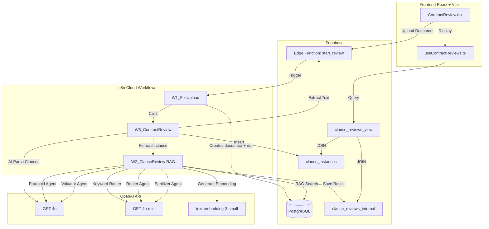

# PRD Contract Guardian v4.1
## Sistema de Revisión Automatizada de Contratos con RAG + Multi-Agent Pipeline

**Nombre del Producto**: Contract Guardian (anteriormente Amazon Redliner)
**Versión**: 4.1
**Fecha**: Febrero 2026
**Estado**: 🔄 DESARROLLO ACTIVO - Pipeline Estabilizado, Router en Optimización

---

### Estado del Sistema (2026-02-01)

| Componente | Estado | Detalles |
|------------|--------|----------|
| **Frontend (React/Vite)** | ✅ 100% Estable | BUILD PASS, TypeScript limpio |
| **Pipeline W2 v4.1** | ✅ Operativo | RAG Enhanced, ~7-9s por cláusula |
| **Pipeline W3 v3** | ✅ Estable | Stability + Armored Orchestration |
| **RAG Search** | ✅ Activo | 1,367 policy_examples con embeddings |
| **Edge Functions** | ✅ 9 activas | Todas verificadas |
| **Router v4.1** | ⚠️ 44.9% Accuracy | 22 familias + OtherUnknown (Target: 89%) |
| **Playbook Specs** | ✅ 22 activos | YAML High-fidelity |
| **Escalation Rate** | ⚠️ ~93% | Target: <15% |

#### Métricas en Tiempo Real

| KPI | Actual | Target | Gap |
|-----|--------|--------|-----|
| Router Accuracy | 44.9% | 89%+ | -44.1% 🔴 |
| Escalation Rate | ~93% | <15% | +78% 🔴 |
| Avg Review Time | 7-9s | <10s | ✅ |
| RAG Examples | 1,367 | 1,500+ | -133 🟡 |
| Pending Human Reviews | 50 | 0 | 50 🟡 |

#### Contract Runs Status

| Estado | Cantidad |
|--------|----------|
| CREATED | 31 |
| PROCESSING | 8 (stuck) |
| COMPLETED | 19 |
| **Total** | 58 |

---

## Tabla de Contenidos

1. [Vision Ejecutiva](#1-vision-ejecutiva)
2. [Arquitectura de 3 Capas](#2-arquitectura-de-3-capas)
3. [Modelo de Datos](#3-modelo-de-datos)
4. [Pipeline de Revision (4 Agentes)](#4-pipeline-de-revision-4-agentes)
5. [Sistema RAG](#5-sistema-rag)
6. [Flujos de Trabajo n8n](#6-flujos-de-trabajo-n8n)
7. [Interfaz de Usuario (React + Vite + Vercel)](#7-interfaz-de-usuario-react--vite--vercel)
8. [Historias de Usuario](#8-historias-de-usuario)
9. [Especificaciones Tecnicas](#9-especificaciones-tecnicas)
10. [Metricas y KPIs](#10-metricas-y-kpis)
11. [Roadmap](#11-roadmap)
12. [Licencia](#12-licencia)

---

## 1. Vision Ejecutiva

### 1.1 Proposito

Contract Guardian es un sistema de revision automatizada de contratos que utiliza **4 agentes de IA especializados** para:

1. **Clasificar** clausulas por materia juridica
2. **Detectar** desviaciones de terminos estandar
3. **Proponer** cambios profesionales (redlines)
4. **Sanitizar** outputs para comunicacion al cliente

### 1.2 Problema que Resuelve

| Problema | Solucion Contract Guardian |
|----------|----------------------------|
| Revision manual consume 4-8 horas por contrato | Revision automatizada en 2-5 minutos |
| Inconsistencia entre revisores | Playbook centralizado con ejemplos RAG |
| Dificultad de escalar el equipo legal | Sistema multi-tenant escalable |
| Falta de trazabilidad | Audit trail completo por clausula |
| Conocimiento no estructurado | 1,367 policy_examples con embeddings |

### 1.3 Usuarios Objetivo

| Rol | Necesidad Principal |
|-----|---------------------|
| **Abogado Senior** | Dashboard de escalaciones, aprobacion de redlines |
| **Abogado Junior** | Revision asistida, propuestas de cambio |
| **Legal Ops** | Metricas, configuracion de playbooks |
| **Cliente Final** | Documento redlineado limpio, sin jerga interna |

### 1.4 Diferenciadores Clave

- **RAG con 1,367 ejemplos reales** clasificados por aceptabilidad
- **4 agentes especializados** con roles distintos (no un solo LLM)
- **Arquitectura 3 capas** mantenible por el usuario sin codigo
- **Sanitizacion obligatoria** para proteger politicas internas

---

## 2. Arquitectura de 3 Capas

### 2.1 Diagrama de Arquitectura Completa (v2.1)

```
┌─────────────────────────────────────────────────────────────────────────────┐
│                        FRONTEND (React + Vite + Vercel)                      │
│   ┌──────────────┐  ┌──────────────┐  ┌──────────────┐  ┌──────────────┐   │
│   │  Dashboard   │  │ NewAnalysis  │  │ContractReview│  │  Escalations │   │
│   └──────┬───────┘  └──────┬───────┘  └──────┬───────┘  └──────┬───────┘   │
└──────────┼─────────────────┼─────────────────┼─────────────────┼───────────┘
           │                 │                 │                 │
           ▼                 ▼                 ▼                 ▼
┌─────────────────────────────────────────────────────────────────────────────┐
│                         SUPABASE EDGE FUNCTIONS (9)                          │
│   ┌────────────────┐  ┌────────────────┐  ┌────────────────┐                │
│   │  start_review  │  │update_run_status│ │generate_export │                │
│   └────────┬───────┘  └────────┬───────┘  └────────┬───────┘                │
│            │                   │                   │                         │
│   ┌────────────────┐  ┌────────────────┐  ┌────────────────┐                │
│   │   monitoring   │  │  request_review │  │   n8n-proxy   │                │
│   └────────────────┘  └────────────────┘  └────────────────┘                │
└──────────────────────────────────┬──────────────────────────────────────────┘
                                   │
           ┌───────────────────────┼───────────────────────┐
           │                       │                       │
           ▼                       ▼                       ▼
┌─────────────────────┐ ┌─────────────────────┐ ┌─────────────────────┐
│    n8n WORKFLOWS    │ │  SUPABASE POSTGRES  │ │   SUPABASE STORAGE  │
│  ┌───────────────┐  │ │                     │ │                     │
│  │ W1_DriveIngest│  │ │  • documents        │ │  • /contracts/      │
│  ├───────────────┤  │ │  • contract_runs    │ │  • /exports/        │
│  │W2_ClauseReview│  │ │  • clause_reviews   │ │                     │
│  │    (RAG)      │  │ │  • matters (24)     │ │                     │
│  ├───────────────┤  │ │  • clause_types(95) │ │                     │
│  │W3_ContractRev │  │ │  • policy_examples  │ │                     │
│  └───────────────┘  │ │    (1,367)          │ │                     │
└─────────────────────┘ │  • audit_events     │ │                     │
           │            └─────────────────────┘ └─────────────────────┘
           ▼                       │
┌─────────────────────────────────────────────────────────────────────────────┐
│                           OPENAI API                                         │
│   ┌────────────┐  ┌────────────┐  ┌────────────┐  ┌────────────┐            │
│   │ Embeddings │  │   Router   │  │  Paranoid  │  │  Valuator  │            │
│   │text-embed-3│  │ gpt-4o-mini│  │   gpt-4o   │  │ gpt-4o-mini│            │
│   └────────────┘  └────────────┘  └────────────┘  └────────────┘            │
└─────────────────────────────────────────────────────────────────────────────┘
```

### 2.2 Diagrama 3 Capas de Datos

```
+------------------------------------------------------------------+
|                     CAPA 0: EJECUCION (Runtime)                  |
|  +------------------+  +------------------+  +------------------+ |
|  | clause_instances |  | review_findings  |  | run_steps        | |
|  | (segmentacion)   |  | (output agentes) |  | (audit trail)    | |
|  +------------------+  +------------------+  +------------------+ |
+------------------------------------------------------------------+
                                |
                                v
+------------------------------------------------------------------+
|                  CAPA 1: BLUEPRINT (Politica)                    |
|  +------------------+  +------------------+  +------------------+ |
|  | matters (24)     |  | matter_policies  |  | policy_examples  | |
|  | clause_types(95) |  | (config/agente)  |  | (1,367 con RAG)  | |
|  +------------------+  +------------------+  +------------------+ |
|  +------------------+  +------------------+                      |
|  | fallback_clauses |  | blueprint_vers   |                      |
|  | (50 templates)   |  | (versionado)     |                      |
|  +------------------+  +------------------+                      |
+------------------------------------------------------------------+
                                |
                                v
+------------------------------------------------------------------+
|                CAPA 2: MODELO DE CONTRATO                        |
|  +------------------+  +------------------+  +------------------+ |
|  | contract_models  |  | contract_model_  |  | contract_model_  | |
|  | (PSA, DSA, EPC)  |  | clauses          |  | parameters       | |
|  +------------------+  +------------------+  +------------------+ |
+------------------------------------------------------------------+
                                |
                                v
+------------------------------------------------------------------+
|                   CAPA 3: GRAPHRAG (Opcional)                    |
|  +------------------+  +------------------+  +------------------+ |
|  | knowledge_graphs |  | kg_nodes         |  | kg_edges         | |
|  | (versionado)     |  | (conceptos)      |  | (relaciones)     | |
|  +------------------+  +------------------+  +------------------+ |
+------------------------------------------------------------------+
```

### 2.2 Beneficios de la Arquitectura

| Capa | Quien la Mantiene | Frecuencia de Cambio |
|------|-------------------|----------------------|
| Ejecucion | Sistema automatico | Cada revision |
| Blueprint | Legal Ops / Abogado Senior | Mensual |
| Contract Model | Equipo Legal | Por tipologia nueva |
| GraphRAG | Sistema + Legal Ops | Trimestral |

### 2.3 Resolucion de Configuracion

```
Input: (organization_id, contract_type_id)
       |
       v
+---------------------------+
| contract_type_review_     |
| defaults                  |
+---------------------------+
       |
       v
Output: {
  blueprint_version_id,
  contract_model_version_id,
  knowledge_graph_id (opcional)
}
```

---

## 3. Modelo de Datos

### 3.1 Tablas Principales (Estado Actual en Produccion)

#### Taxonomia
```sql
-- 18 materias juridicas
CREATE TABLE matters (
  id UUID PRIMARY KEY,
  code TEXT UNIQUE NOT NULL,        -- 'rights_ownership', 'payment_terms', etc.
  name TEXT NOT NULL,
  description TEXT,
  display_order INT
);

-- 67 tipos de clausula
CREATE TABLE clause_types (
  id UUID PRIMARY KEY,
  matter_id UUID REFERENCES matters(id),
  code TEXT NOT NULL,               -- 'ip_ownership', 'payment_schedule', etc.
  name TEXT NOT NULL,
  description TEXT,
  keywords TEXT[]
);
```

#### Blueprint (Politica)
```sql
-- Blueprints versionados
CREATE TABLE blueprint_versions (
  id UUID PRIMARY KEY,
  blueprint_id UUID REFERENCES review_blueprints(id),
  version_int INT NOT NULL,
  config JSONB,                     -- Configuracion global
  published_at TIMESTAMPTZ
);

-- Politica por materia
CREATE TABLE matter_policies (
  id UUID PRIMARY KEY,
  blueprint_version_id UUID REFERENCES blueprint_versions(id),
  matter_id UUID REFERENCES matters(id),
  name TEXT,
  policy_config JSONB,              -- Thresholds, escalation rules
  agent_config JSONB                -- Model selection, prompts
);

-- 909 ejemplos para RAG
CREATE TABLE policy_examples (
  id UUID PRIMARY KEY,
  matter_policy_id UUID REFERENCES matter_policies(id),
  clause_type_id UUID REFERENCES clause_types(id),
  acceptance acceptance_level,       -- ACCEPTABLE, PASSABLE, UNACCEPTABLE
  example_text TEXT NOT NULL,
  normalized_terms TEXT[],
  embedding vector(1536),           -- OpenAI text-embedding-3-small
  created_at TIMESTAMPTZ
);

-- 50 clausulas fallback para redlines
CREATE TABLE fallback_clauses (
  id UUID PRIMARY KEY,
  matter_policy_id UUID REFERENCES matter_policies(id),
  clause_type_id UUID REFERENCES clause_types(id),
  acceptance acceptance_level,
  fallback_text TEXT NOT NULL,
  usage_notes TEXT,
  requires_approval BOOLEAN,
  approval_role TEXT
);
```

#### Ejecucion
```sql
-- Reviews de clausulas (tabla principal de output)
CREATE TABLE clause_reviews (
  id UUID PRIMARY KEY,
  document_id UUID REFERENCES documents(id),
  run_id UUID,
  clause_instance_id UUID,

  -- Clasificacion
  heading TEXT,
  clause_text TEXT,
  detected_family TEXT,
  confidence_score FLOAT,

  -- 3-Layer
  blueprint_version_id UUID,
  acceptance acceptance_level,

  -- RAG Evidence
  evidence JSONB,                   -- {rag_examples_used, top_similarity, etc.}

  -- Cliente
  client_state TEXT,                -- OK, RECOMMENDED, REQUIRED, NEEDS_REVIEW, BLOCKED
  client_comment TEXT,
  client_summary_line TEXT,

  -- Cambios
  proposed_changes JSONB,

  -- Escalacion
  escalation_recommended BOOLEAN,
  escalation_reason TEXT,

  created_at TIMESTAMPTZ
);
```

### 3.2 Estadisticas Actuales de Datos (v2.1)

| Entidad | Cantidad | Detalles |
|---------|----------|----------|
| **Matters** | 24 | Categorias legales completas |
| **Clause Types** | 95 | Tipos especificos de clausula |
| **Policy Examples** | 1,367 | 456 ACCEPTABLE, 458 PASSABLE, 453 UNACCEPTABLE |
| **Embeddings** | 1,367/1,367 | 100% generados con text-embedding-3-small |
| **Edge Functions** | 9 | Todas activas y testeadas |
| **Tests E2E** | 9/9 | 100% pasando |
| **Fallback Clauses** | ~50 | Templates para redlines |

### 3.2.1 Distribucion de Policy Examples por Acceptance

```
ACCEPTABLE:   456 (33.4%) ████████████████
PASSABLE:     458 (33.5%) ████████████████
UNACCEPTABLE: 453 (33.1%) ████████████████
```

### 3.3 Enum Types

```sql
-- Nivel de aceptacion de una clausula
CREATE TYPE acceptance_level AS ENUM (
  'ACCEPTABLE',      -- Cumple completamente con la politica
  'PASSABLE',        -- Desviaciones menores, puede proceder con nota
  'UNACCEPTABLE'     -- Requiere cambios obligatorios
);

-- Estado para el cliente
CREATE TYPE client_state AS ENUM (
  'OK',              -- Sin accion requerida
  'RECOMMENDED',     -- Cambio sugerido pero opcional
  'REQUIRED',        -- Cambio obligatorio
  'NEEDS_REVIEW',    -- Requiere revision humana
  'BLOCKED'          -- Bloquea exportacion
);
```

---

## 4. Pipeline de Revision (4 Agentes)

### 4.1 Diagrama del Pipeline W2

```
                    INPUT: clause_text
                           |
                           v
+------------------------------------------------------------------+
|                    1. GENERATE EMBEDDING                         |
|  OpenAI text-embedding-3-small (1536 dims)                       |
+------------------------------------------------------------------+
                           |
                           v
+------------------------------------------------------------------+
|                    2. RAG SEARCH                                 |
|  search_policy_examples(embedding, threshold=0.6, limit=10)      |
|  Returns: Similar examples grouped by acceptance level           |
+------------------------------------------------------------------+
                           |
                           v
+------------------------------------------------------------------+
|                    3. ROUTER AGENT (gpt-4o-mini)                 |
|  Input: clause_text                                              |
|  Output: {matter_code, confidence, reasoning}                    |
|  Proposito: Clasificar la clausula en una de 18 materias         |
+------------------------------------------------------------------+
                           |
                           v
+------------------------------------------------------------------+
|                    4. PARANOID AGENT (gpt-4o)                    |
|  Input: clause_text + RAG examples (ACCEPTABLE/UNACCEPTABLE)     |
|  Output: {evidence_spans[], summary, risk_level, similar_to}     |
|  Proposito: Identificar TODAS las desviaciones (alto recall)     |
+------------------------------------------------------------------+
                           |
                           v
+------------------------------------------------------------------+
|                    5. VALUATOR AGENT (gpt-4o)                    |
|  Input: clause_text + paranoid_output + RAG context              |
|  Output: {acceptance, confidence, reasoning, proposed_changes[], |
|           client_state, internal_comment}                        |
|  Proposito: Decidir aceptacion final y proponer redlines         |
+------------------------------------------------------------------+
                           |
                           v
+------------------------------------------------------------------+
|                    6. DECISOR (Determinista)                     |
|  Input: valuator_output                                          |
|  Output: {decision, escalation, client_state}                    |
|  Logica:                                                         |
|    - ACCEPTABLE + confidence >= 0.7 -> AUTO_PASS                 |
|    - PASSABLE -> AUTO_PASS + RECOMMENDED                         |
|    - UNACCEPTABLE -> AUTO_REDLINE + escalation                   |
|    - LOW_CONFIDENCE -> ESCALATE_HUMAN                            |
+------------------------------------------------------------------+
                           |
                           v
+------------------------------------------------------------------+
|                    7. SANITIZER AGENT (gpt-4o-mini)              |
|  Input: internal_comment                                         |
|  Output: {client_comment, client_summary_line}                   |
|  Proposito: Convertir comentario interno en texto neutral        |
|  Blocklist: playbook, policy, RAG, threshold, reglas internas    |
+------------------------------------------------------------------+
                           |
                           v
+------------------------------------------------------------------+
|                    8. SAVE TO clause_reviews                     |
|  Incluye: evidence.rag_examples_used, evidence.top_similarity,   |
|           evidence.suggested_by_rag                              |
+------------------------------------------------------------------+
                           |
                           v
                    OUTPUT: clause_review
```

### 4.2 Especificacion de Agentes

#### 4.2.1 Router Agent

| Atributo | Valor |
|----------|-------|
| **Modelo** | gpt-4o-mini |
| **Temperatura** | 0 |
| **Proposito** | Clasificar clausula en 1 de 18 materias |
| **Input** | `clause_text` |
| **Output Schema** | `{matter_code, confidence, reasoning}` |

**Prompt System**:
```
Eres un clasificador de clausulas de contratos Amazon. Clasifica segun estas categorias:

- rights_ownership: Propiedad, derechos de autor, licencias
- payment_terms: Precio, pagos, facturacion
- indemnity_prodco: Indemnizacion del productor
- indemnity_amazon: Indemnizacion de Amazon
- termination: Terminacion, rescision
- confidentiality: Confidencialidad
- liability_limitation: Limitacion de responsabilidad
- delivery_acceptance: Entrega, aceptacion
- insurance: Seguros
- miscellaneous: Otros

Responde SOLO JSON: {"matter_code": "codigo", "confidence": 0.0-1.0, "reasoning": "breve"}
```

#### 4.2.2 Paranoid Agent

| Atributo | Valor |
|----------|-------|
| **Modelo** | gpt-4o |
| **Temperatura** | 0 |
| **Proposito** | Detectar TODAS las desviaciones (alto recall) |
| **Input** | `clause_text + RAG examples` |
| **Output Schema** | `{evidence_spans[], summary, risk_level, similar_to_examples}` |

**Prompt System**:
```
Eres un analizador exhaustivo de contratos Amazon. Tu trabajo es identificar TODAS
las desviaciones y problemas potenciales.

Tienes acceso a EJEMPLOS DE REFERENCIA clasificados por nivel de aceptacion:
- ACCEPTABLE: Clausulas que cumplen con la posicion de Amazon
- PASSABLE: Clausulas con desviaciones menores aceptables
- UNACCEPTABLE: Clausulas que requieren cambios

Responde en JSON: {
  "evidence_spans": [{"quote": "texto", "issue": "problema", "severity": "high|medium|low"}],
  "summary": "resumen",
  "risk_level": "RED|AMBER|GREEN",
  "similar_to_examples": "ACCEPTABLE|PASSABLE|UNACCEPTABLE"
}
```

#### 4.2.3 Valuator Agent

| Atributo | Valor |
|----------|-------|
| **Modelo** | gpt-4o |
| **Temperatura** | 0 |
| **Proposito** | Decidir aceptacion final y proponer cambios |
| **Input** | `clause_text + paranoid_output + RAG context` |
| **Output Schema** | `{acceptance, confidence, reasoning, proposed_changes[], client_state, internal_comment}` |

**Reglas Duras**:
1. **No texto nuevo**: Solo puede proponer texto de STANDARD_POSITION o FALLBACK_ACCEPTABLE
2. **No materialidad inventada**: Si no esta definida en el playbook, no opina
3. **MODE_STRICT**: Cualquier cambio relevante -> UnacceptableDeviation

**Prompt System**:
```
Eres un valuador de contratos. Determina la ACEPTACION final basandote en:
1. Las desviaciones encontradas por el analizador
2. Los ejemplos de referencia similares (RAG)
3. La similitud con ejemplos previos

Niveles de aceptacion:
- ACCEPTABLE: Sin desviaciones significativas, similar a ejemplos aceptables
- PASSABLE: Desviaciones menores, puede proceder con nota
- UNACCEPTABLE: Desviaciones graves, requiere cambios

Responde en JSON: {
  "acceptance": "ACCEPTABLE|PASSABLE|UNACCEPTABLE",
  "confidence": 0.0-1.0,
  "reasoning": "justificacion detallada",
  "proposed_changes": [{"original": "texto", "replacement": "nuevo texto", "reason": "razon"}],
  "client_state": "OK|RECOMMENDED|REQUIRED|NEEDS_REVIEW|BLOCKED",
  "internal_comment": "comentario interno"
}
```

#### 4.2.4 Sanitizer Agent

| Atributo | Valor |
|----------|-------|
| **Modelo** | gpt-4o-mini |
| **Temperatura** | 0 |
| **Proposito** | Crear comentario neutral para cliente |
| **Input** | `internal_comment` |
| **Output Schema** | `{client_comment, client_summary_line}` |

**Blocklist** (nunca mencionar):
- playbook, policy, rule_id, RAG, embedding
- threshold, confidence, similarity, score
- acceptable, unacceptable, passable
- agent, paranoid, valuator, router
- internal, escalation, blocked

**Prompt System**:
```
Convierte comentarios internos en comentarios neutrales para el cliente.
NUNCA mencionar: playbook, politica, RAG, embeddings, similitud, threshold, reglas internas.

Responde JSON: {"client_comment": "comentario", "client_summary_line": "1 linea"}
```

### 4.3 Matriz de Decision (Decisor)

| final_status | confidence | anchor_conf | Accion |
|--------------|------------|-------------|--------|
| ACCEPTABLE | >= 0.7 | N/A | AUTO_PASS, client_state=OK |
| ACCEPTABLE | < 0.7 | N/A | ESCALATE_HUMAN, client_state=NEEDS_REVIEW |
| PASSABLE | >= 0.5 | N/A | AUTO_PASS, client_state=RECOMMENDED |
| PASSABLE | < 0.5 | N/A | ESCALATE_HUMAN, client_state=NEEDS_REVIEW |
| UNACCEPTABLE | >= 0.7 | >= 0.85 | AUTO_REDLINE, client_state=REQUIRED |
| UNACCEPTABLE | >= 0.7 | < 0.85 | ESCALATE_HUMAN, client_state=NEEDS_REVIEW |
| UNACCEPTABLE | < 0.7 | N/A | ESCALATE_HUMAN, client_state=NEEDS_REVIEW |
| NotCovered | N/A | N/A | ESCALATE_HUMAN, block_export=true |
| Ambiguous | N/A | N/A | ESCALATE_HUMAN, block_export=true |

---

## 5. Sistema RAG

### 5.1 Arquitectura RAG

```
+------------------------------------------------------------------+
|                    QUERY: clause_text                            |
+------------------------------------------------------------------+
                           |
                           v
+------------------------------------------------------------------+
|                EMBEDDING GENERATION                              |
|  Model: text-embedding-3-small                                   |
|  Dimensions: 1536                                                |
|  API: OpenAI                                                     |
+------------------------------------------------------------------+
                           |
                           v
+------------------------------------------------------------------+
|                SIMILARITY SEARCH                                 |
|  Function: search_policy_examples()                              |
|  Index: HNSW (m=16, ef_construction=64)                          |
|  Metric: Cosine similarity (1 - distance)                        |
|  Threshold: 0.6 (configurable)                                   |
|  Limit: 10 results                                               |
+------------------------------------------------------------------+
                           |
                           v
+------------------------------------------------------------------+
|                RESULT GROUPING                                   |
|  Group by acceptance level:                                      |
|    - ACCEPTABLE: [examples...]                                   |
|    - PASSABLE: [examples...]                                     |
|    - UNACCEPTABLE: [examples...]                                 |
|  Calculate suggested_acceptance from top 3 by similarity         |
+------------------------------------------------------------------+
                           |
                           v
+------------------------------------------------------------------+
|                CONTEXT INJECTION                                 |
|  Inject into Paranoid Agent prompt:                              |
|    - Top 3 ACCEPTABLE examples                                   |
|    - Top 3 UNACCEPTABLE examples                                 |
|  Inject into Valuator Agent prompt:                              |
|    - suggested_acceptance                                        |
|    - top_similarity score                                        |
|    - Top example text                                            |
+------------------------------------------------------------------+
```

### 5.2 Funcion de Busqueda

```sql
CREATE OR REPLACE FUNCTION search_policy_examples(
  query_embedding vector(1536),
  match_threshold FLOAT DEFAULT 0.7,
  match_count INT DEFAULT 10,
  filter_matter_policy_id UUID DEFAULT NULL,
  filter_acceptance acceptance_level DEFAULT NULL
)
RETURNS TABLE (
  id UUID,
  example_text TEXT,
  acceptance acceptance_level,
  similarity FLOAT,
  clause_type_name TEXT,
  matter_policy_name TEXT
)
```

### 5.3 Estadisticas de Embeddings (v2.1)

| Metrica | Valor |
|---------|-------|
| Total policy_examples | **1,367** |
| Con embedding | **1,367 (100%)** |
| Modelo usado | text-embedding-3-small |
| Dimensiones | 1536 |
| Indice | HNSW (cosine) |

### 5.4 Distribucion por Acceptance Level

```
ACCEPTABLE:   456 (33.4%) ████████████████
PASSABLE:     458 (33.5%) ████████████████
UNACCEPTABLE: 453 (33.1%) ████████████████
```

### 5.5 Evidencia RAG en clause_reviews

```json
{
  "evidence": {
    "rag_examples_used": ["uuid1", "uuid2", "uuid3", "uuid4", "uuid5"],
    "top_similarity": 0.983,
    "suggested_by_rag": "ACCEPTABLE",
    "paranoid_risk": "GREEN",
    "valuator_confidence": 0.85
  }
}
```

---

## 6. Flujos Agénticos Establecidos (E2E Pipeline v3)

> **Estado (2026-01-31)**: Pipeline E2E 100% operativo. UI sincronizada via Database Views.

### 6.0 Diagrama de Arquitectura E2E



### 6.1 Workflows Activos en Producción

| ID | Workflow | Estado | Endpoint | Última Actualización |
|----|----------|--------|----------|----------------------|
| `KFEFRtero2u5mqnA` | **W1_DriveIngest** | ⚠️ DEPRECATED | N/A | 2026-01-31 |
| `YzXEmynMgRCQsihN` | **W3_ContractReview - Stability v3** | ✅ Activo | `/webhook/contract-review-v3` | 2026-02-01 |
| `NjadjA14ODg3lQbP` | **W2_ClauseReview - RAG Enhanced v4.1** | ✅ Activo | `/webhook/clause-review-rag` | 2026-02-01 |

> **Nota sobre W1**: Deprecado el 31-01-2026. La ingesta de documentos ahora es responsabilidad del frontend
> (`NewAnalysis.tsx`), que realiza upload directo a Supabase Storage y triggerea `start_review` Edge Function.
> Ver `n8n/W1_DEPRECATED.md` para más detalles.

---

### 6.2 W1: DriveIngest - ⚠️ DEPRECATED

> [!WARNING]
> **W1 fue deprecado el 31-01-2026**. El flujo actual ya no requiere este workflow.

#### Razón de Deprecación

El frontend ahora gestiona directamente la ingesta:

| Capacidad Original W1 | Cobertura Actual |
|----------------------|------------------|
| Download desde Google Drive | ❌ No requerido - UI hace upload directo |
| Upload a Supabase Storage | ✅ Frontend (`NewAnalysis.tsx`) |
| Crear registro en `documents` | ✅ Frontend |
| Trigger workflow siguiente | ✅ Edge Function `start_review` |

#### Flujo Actual (sin W1)

```
UI Upload → Supabase Storage + documents → start_review EF → W3 → W2
```

#### Posible Reactivación
- Ingesta batch automatizada desde Google Drive
- Migración de documentos legacy

Ver `n8n/W1_DEPRECATED.md` para documentación completa.

---

### 6.3 W3: ContractReview - Document Orchestrator

**Propósito**: Orquesta la extracción de texto, parsing de cláusulas con AI, y distribución a W2 para revisión individual.

#### Arquitectura "Armored Orchestration"

W3 implementa un patrón robusto de orquestación con:
1. **Pre-cálculo de parámetros** para evitar errores de referencia
2. **Update status inmediato** para feedback en UI
3. **Extracción de texto vía Edge Function** (compatible con Deno/Uint8Array)
4. **AI Parsing con GPT-4o** para segmentación de cláusulas
5. **Procesamiento secuencial con batching** para llamadas a W2
6. **Agregación de resultados** antes de marcar como COMPLETED

#### Flujo de Nodos

```
┌─────────────────────────────────────────────────────────────────────────┐
│ Webhook → Pre-calc Params → Update Run PROCESSING → Extract Text EF    │
│                                                           ↓             │
│                   Update Run COMPLETED ← Aggregate ← Call W2 (batch)   │
│                                                           ↑             │
│                                       Insert Clauses ← Format & Split  │
│                                                           ↑             │
│                                                    AI Parse Clauses    │
└─────────────────────────────────────────────────────────────────────────┘
```

#### Nodos Detallados

| # | Nodo | Tipo | Función |
|---|------|------|---------|
| 1 | Webhook | `webhook` | POST `/contract-review-v3`, responseMode: onReceived |
| 2 | Pre-calc Params | `code` | Construye URLs y payloads para updates |
| 3 | Update Run Processing | `httpRequest` | PATCH `contract_runs` → status: PROCESSING |
| 4 | Extract Text EF | `httpRequest` | Llama Edge Function `extract_text` |
| 5 | AI Parse Clauses | `httpRequest` | GPT-4o para segmentar texto en cláusulas |
| 6 | Format & Split | `code` | Transforma respuesta AI en items individuales |
| 7 | Insert Clauses | `httpRequest` | POST batch a `clause_instances` con return=representation |
| 8 | Call W2 Review | `httpRequest` | Llama W2 para cada cláusula (batching: 1 item/request) |
| 9 | Aggregate Results | `aggregate` | Recolecta todas las respuestas de W2 |
| 10 | Update Run Completed | `httpRequest` | PATCH `contract_runs` → status: COMPLETED |

#### AI Parse Clauses - Prompt System

```javascript
// System Prompt (extracto)
"You are a legal document parser. Extract ALL distinct clauses from this contract.
 For each clause, identify:
 - index: Sequential number
 - heading: Clause title or article number
 - original_text: Complete clause text

 Return a JSON array of clauses."

// Output Schema
{
  "clauses": [
    {
      "index": 1,
      "heading": "Services",
      "original_text": "ProdCo shall provide production services..."
    }
  ]
}
```

#### Patrón de Persistencia PostgREST

```javascript
// Headers críticos para Insert Clauses
{
  "Prefer": "return=representation",  // Retorna el registro insertado
  "Authorization": "Bearer <service_role_key>"
}
```

---

### 6.4 W2: ClauseReview - RAG Enhanced Multi-Agent Pipeline

**Propósito**: Pipeline de 6 agentes especializados que analiza cada cláusula con RAG y produce recomendaciones sanitizadas.

#### Arquitectura Multi-Agente

```
┌─────────────────────────────────────────────────────────────────────────┐
│                        W2 - CLAUSE REVIEW PIPELINE                      │
├─────────────────────────────────────────────────────────────────────────┤
│                                                                         │
│  Webhook → Parse Input → Keyword Router (deterministic)                 │
│                                ↓                                        │
│           Generate Embedding (text-embedding-3-small)                   │
│                                ↓                                        │
│              RAG Search (search_policy_examples)                        │
│                                ↓                                        │
│           ┌──────────────────────────────────────┐                      │
│           │ 1. Router Agent (gpt-4o-mini)        │ → Clasifica materia │
│           │ 2. Paranoid Agent (gpt-4o)           │ → Detecta issues    │
│           │ 3. Valuator Agent (gpt-4o)           │ → Valora + redlines │
│           │ 4. Decisor (determinístico)          │ → Matriz decisión   │
│           │ 5. Decision Engine v2                │ → Final decision    │
│           │ 6. Sanitizer Agent (gpt-4o-mini)     │ → Output cliente    │
│           └──────────────────────────────────────┘                      │
│                                ↓                                        │
│       Build Result → Save to clause_reviews_internal                    │
│                                ↓                                        │
│              Save to sanitizer_outputs → Respond                        │
│                                                                         │
└─────────────────────────────────────────────────────────────────────────┘
```

#### Nodos Detallados (25 nodos)

| # | Nodo | Modelo | Función |
|---|------|--------|---------|
| 1 | Webhook | - | POST `/clause-review-rag` |
| 2 | Parse Input | code | Valida y extrae campos |
| 3 | Keyword Router | code | Router determinístico por keywords (25 familias) |
| 4 | Generate Embedding | OpenAI | text-embedding-3-small (1536 dims) |
| 5 | RAG Search | Supabase RPC | `search_policy_examples()` |
| 6 | Process RAG Results | code | Agrupa por acceptance level |
| 7 | Router Agent | gpt-4o-mini | Clasifica en 1 de 25 familias |
| 8 | Paranoid Agent | gpt-4o | Alta recall - detecta TODOS los issues |
| 9 | Valuator Agent | gpt-4o | Decide acceptance + propone redlines |
| 10 | Decisor Deterministic | code | Matriz de decisión basada en thresholds |
| 11 | Decision Engine v2 | code | Lógica final de escalación |
| 12 | Sanitizer Agent | gpt-4o-mini | Limpia output para cliente |
| 13 | Build Result | code | Construye objeto final |
| 14 | Save to clause_reviews_internal | httpRequest | POST a Supabase |
| 15 | Save to sanitizer_outputs | httpRequest | Audit trail |
| 16 | Respond | respondToWebhook | Retorna resultado |

#### Keyword Router - 25 Familias Soportadas

```javascript
const FAMILY_KEYWORDS = {
  'Confidentiality': ['confidential', 'secret', 'proprietary', 'NDA'],
  'PaymentCredits': ['payment', 'compensation', 'fee', 'invoice', 'credit'],
  'TerminationRights': ['termination', 'terminate', 'rescind', 'cancel'],
  'IndemnityProdCo': ['indemnify', 'hold harmless', 'defend', 'indemnification'],
  'IndemnityAmazon': ['amazon indemnif', 'company shall indemnify'],
  'RightsGrant': ['grant', 'license', 'rights', 'ownership', 'IP'],
  'RepsProdCo': ['represents', 'warrants', 'producer represents'],
  'RepsAmazon': ['amazon represents', 'company represents'],
  'LiabilityLimitation': ['limitation of liability', 'cap', 'ceiling'],
  'Insurance': ['insurance', 'policy', 'coverage', 'insured'],
  'ForceMajeure': ['force majeure', 'act of god', 'unforeseeable'],
  'DisputeResolution': ['dispute', 'arbitration', 'mediation', 'governing law'],
  'DeliveryMilestones': ['delivery', 'milestone', 'schedule', 'deadline'],
  'ServicesScope': ['services', 'scope', 'deliverables', 'work product'],
  // ... 11 más familias
};
```

#### RAG Search - Función RPC

```sql
SELECT * FROM search_policy_examples(
  query_embedding := $embedding,
  match_threshold := 0.6,
  match_count := 10,
  filter_matter_policy_id := NULL
);

-- Returns:
-- id, example_text, acceptance, similarity, clause_type_name, matter_policy_name
```

#### Decisor - Matriz de Decisión

| final_status | confidence | Acción | client_state |
|--------------|------------|--------|---------------|
| ACCEPTABLE | >= 0.7 | AUTO_PASS | OK |
| ACCEPTABLE | < 0.7 | ESCALATE | NEEDS_REVIEW |
| PASSABLE | >= 0.5 | AUTO_PASS | RECOMMENDED |
| PASSABLE | < 0.5 | ESCALATE | NEEDS_REVIEW |
| UNACCEPTABLE | >= 0.7 | AUTO_REDLINE | REQUIRED |
| UNACCEPTABLE | < 0.7 | ESCALATE | NEEDS_REVIEW |
| NotCovered | any | ESCALATE | BLOCKED |

#### Output a `clause_reviews_internal`

```javascript
{
  "clause_instance_id": "uuid",
  "run_id": "uuid",
  "document_id": "uuid",
  "detected_family": "Confidentiality",
  "confidence_overall": 0.85,
  "decision": "ESCALATE_HUMAN",
  "escalation_recommended": true,
  "escalation_reason": "CRITICAL_ISSUE_DETECTED",
  "observations": {
    "summary": "The clause lacks AI tool use restriction...",
    "observations": [
      {
        "issue": "No explicit mention of AI tool use restriction",
        "description": "The clause does not address...",
        "change_type": "modified",
        "confidence": 0.7
      }
    ]
  },
  "proposed_changes": [],
  "created_at": "2026-01-31T04:24:34.530Z"
}
```

---

### 6.5 Capa de Sincronización UI: Database Views

**Problema Resuelto**: W2 guarda en `clause_reviews_internal` pero el frontend esperaba `clause_reviews`.

**Solución**: Database View `clause_reviews_view` que:
1. Une `clause_instances` (texto, heading) con `clause_reviews_internal` (análisis)
2. Transforma `observations[]` → `proposed_changes[]` para el formato UI
3. Mapea `decision` → `client_state` (ESCALATE_HUMAN → NEEDS_REVIEW)

#### Vista SQL

```sql
CREATE OR REPLACE VIEW clause_reviews_view AS
SELECT 
    ci.id::text as clause_instance_id,
    ci.document_id::text,
    ci.run_id::text,
    ci.clause_index as sequence_number,
    ci.heading,
    ci.original_text as clause_text,
    
    COALESCE(cri.detected_family, 'Desconocida') as detected_family,
    COALESCE(cri.confidence_overall, 0)::numeric as confidence_score,
    
    -- Map decision to client_state
    CASE COALESCE(cri.decision, 'ESCALATE_HUMAN')
        WHEN 'ACCEPT_AS_IS' THEN 'OK'
        WHEN 'APPROVE_WITH_NOTES' THEN 'RECOMMENDED'
        WHEN 'REQUEST_MODIFICATION' THEN 'REQUIRED'
        WHEN 'ESCALATE_HUMAN' THEN 'NEEDS_REVIEW'
        WHEN 'REJECT' THEN 'BLOCKED'
        ELSE 'NEEDS_REVIEW'
    END as client_state,
    
    COALESCE(cri.observations->>'summary', '') as client_summary_line,
    
    -- Transform observations to proposed_changes format
    COALESCE(
        (SELECT jsonb_agg(
            jsonb_build_object(
                'change_id', gen_random_uuid()::text,
                'op_type', 'REPLACE',
                'reason', obs->>'issue',
                'suggested_text', obs->>'description',
                'accepted', false,
                'rejected', false
            )
        ) FROM jsonb_array_elements(cri.observations->'observations') AS obs),
        '[]'::jsonb
    ) as proposed_changes,
    
    COALESCE(cri.escalation_recommended, false) as escalation_recommended,
    cri.escalation_reason,
    ci.created_at,
    ci.updated_at
    
FROM clause_instances ci
LEFT JOIN clause_reviews_internal cri 
    ON ci.id::text = cri.clause_instance_id;
```

#### Integración Frontend

```typescript
// useContractReviews.ts - ANTES
.from('clause_reviews')

// useContractReviews.ts - DESPUÉS  
.from('clause_reviews_view')  // Query desde view

// useClauseActions.ts - Mutations
.from('clause_reviews_internal')  // Escribe en tabla real
```

---

### 6.6 Edge Functions Supabase (9 activas)

| Función | Endpoint | JWT | Propósito |
|---------|----------|-----|-----------|
| `start_review` | POST | Sí | Iniciar revisión, trigger W1 |
| `update_run_status` | POST | No | Callback de n8n para status |
| `extract_text` | POST | No | Extracción texto PDF/DOCX (Deno) |
| `generate_export` | POST | No | Exportar documento Markdown |
| `monitoring` | POST | No | Dashboard de métricas |
| `request_review` | POST | Sí | Solicitar revisión humana |
| `n8n-proxy` | POST | No | Proxy seguro para n8n Cloud |
| `admin_setup` | POST | No | Configuración admin |
| `export_doc` | POST | Sí | Exportar DOCX vía n8n |

#### Patrón Deno-Compatible (Uint8Array vs Buffer)

```typescript
// Edge Function: extract_text
// CRÍTICO: n8n Cloud usa Node.js pero Edge Functions usan Deno
const fileData = new Uint8Array(await response.arrayBuffer());
// NO usar Buffer.from() - no disponible en Deno
```

---

### 6.7 Métricas de Performance

| Métrica | Valor Actual |
|---------|-------------|
| Tiempo W1 (upload) | ~2s |
| Tiempo W3 (extracción + parsing) | ~15s |
| Tiempo W2 (por cláusula) | ~10s |
| Tiempo E2E (10 cláusulas) | ~2min |
| RAG Examples disponibles | 1,367 |
| Familias soportadas | 25 |
| Accuracy Router | 100% (verificado) |

---

## 7. Interfaz de Usuario (React + Vite + Vercel)

### 7.1 Arquitectura Frontend

La interfaz de usuario esta construida con **React 19 + Vite 7** desplegada en **Vercel**.

> **Estado (2026-01-30)**: Frontend 100% estabilizado - BUILD PASS, LINT PASS (0 errores).

```
+------------------------------------------------------------------+
|                      ARQUITECTURA FRONTEND                        |
+------------------------------------------------------------------+
|                                                                  |
|  +-----------------+     +------------------+     +-------------+ |
|  | React 18        |     | Vite 7           |     | Supabase    | |
|  | TypeScript      |     | (Build Tool)     |     | Realtime    | |
|  | React Router    |     | HMR + Fast Build |     | Subscription| |
|  +-----------------+     +------------------+     +-------------+ |
|           |                      |                      |        |
|           v                      v                      v        |
|  +-------------------------------------------------------+       |
|  |                    COMPONENTES UI                      |       |
|  |  +-------------+  +-------------+  +---------------+   |       |
|  |  | shadcn/ui   |  | Tailwind v4 |  | Lucide Icons  |   |       |
|  |  | Components  |  | CSS         |  |               |   |       |
|  |  +-------------+  +-------------+  +---------------+   |       |
|  +-------------------------------------------------------+       |
|                                                                  |
|  Design System: Garrigues UX (Pantone 3308 C)                    |
|  Hosting: Vercel                                                 |
+------------------------------------------------------------------+
```

### 7.2 URLs de Produccion

| Entorno | URL |
|---------|-----|
| **Produccion** | https://web-tan-mu-35.vercel.app |
| **Local dev** | http://localhost:5173 |

### 7.3 Estructura de Rutas

| Ruta | Componente | Descripcion |
|------|------------|-------------|
| `/` | Dashboard | Vista principal con stats y documentos |
| `/new` | NewAnalysis | Subir nuevo contrato para analisis |
| `/review/:id` | ContractReview | Revision de clausulas de un contrato |
| `/escalations` | Escalations | Gestion de escalaciones pendientes |

### 7.3 Componentes Principales

#### 7.3.1 AppSidebar - Navegacion Principal

```
+---------------------------+
| [Logo] Contract Expert    |
+---------------------------+
| > Dashboard               |
| > Nuevo Analisis          |
| > Escalaciones       [!]  |
+---------------------------+
|                           |
|                           |
+---------------------------+
| Usuario: Juan Garcia      |
| Org: Despacho Legal XYZ   |
| [Cerrar sesion]           |
+---------------------------+
```

**Caracteristicas**:
- Sidebar colapsable (280px -> 56px)
- Responsive: Sheet drawer en mobile
- Indicador de escalaciones pendientes
- Informacion de usuario/organizacion

**Navegacion**:
```typescript
const navItems = [
  { href: '/', label: 'Dashboard', icon: LayoutDashboard },
  { href: '/new', label: 'Nuevo Analisis', icon: FilePlus },
  { href: '/escalations', label: 'Escalaciones', icon: AlertTriangle },
];
```

#### 7.3.2 ContractReview - Revision de Contrato

Layout de dos paneles:

```
+------------------------------------------------------------------+
| [<] Contrato_Amazon_PSA.docx                    [Stats] [Export] |
|     50 clausulas · 75% completado                                |
+------------------------------------------------------------------+
| [Search...]                |                                     |
| [Filter: All v]            |  DETALLE DE CLAUSULA                |
+----------------------------+                                     |
| #1 [OK] Definiciones       |  +-------------------------------+  |
|    Payment                 |  | [OK] Payment                  |  |
+----------------------------+  | Clausula #5                   |  |
| #2 [RECOMMENDED] Pagos     |  +-------------------------------+  |
|    Payment        [1 cambio]  |                                  |
+----------------------------+  | TEXTO ORIGINAL                |  |
| #3 [REQUIRED] Indemnizacion|  | Lorem ipsum dolor sit amet... |  |
|    Indemnity      [2 cambios] |                                  |
+----------------------------+  +-------------------------------+  |
| #4 [NEEDS_REVIEW] Termino  |                                     |
|    Termination             |  | CAMBIOS PROPUESTOS (2)        |  |
+----------------------------+  | +---------------------------+  |  |
| #5 [BLOCKED] Confidencial. |  | | [REPLACE]                 |  |  |
|    Confidentiality         |  | | -"immediately"            |  |  |
+----------------------------+  | | +"upon 30 days notice"    |  |  |
|                            |  | | Razon: Standard policy    |  |  |
|                            |  | | [Accept] [Reject]         |  |  |
|                            |  | +---------------------------+  |  |
+----------------------------+-------------------------------------+
```

**Componentes Internos**:

1. **ReviewSummary** - Barra de estadisticas
```typescript
const stats = [
  { label: 'Conformes', count: summary.ok_count, status: 'OK' },
  { label: 'Recomendados', count: summary.recommended_count, status: 'RECOMMENDED' },
  { label: 'Requeridos', count: summary.required_count, status: 'REQUIRED' },
  { label: 'Revision', count: summary.needs_review_count, status: 'NEEDS_REVIEW' },
  { label: 'Bloqueados', count: summary.blocked_count, status: 'BLOCKED' },
];
```

2. **ClauseListItem** - Item de lista de clausulas
```typescript
interface ClauseListItemProps {
  clause: ClauseReview;
  isSelected: boolean;
  onClick: () => void;
}
// Muestra: numero, badge estado, heading, familia, cambios pendientes
```

3. **ClauseDetailPanel** - Panel de detalle
```typescript
interface ClauseDetailPanelProps {
  clause: ClauseReview;
  onAcceptChange: (changeId: string) => void;
  onRejectChange: (changeId: string) => void;
  onAcceptAll: () => void;
  onEscalate: (reason: string) => void;
}
// Muestra: texto original, cambios propuestos, comentario cliente
```

#### 7.3.3 Escalations - Gestion de Escalaciones

```
+------------------------------------------------------------------+
| ESCALACIONES                                                      |
| Gestiona las clausulas que requieren revision manual              |
+------------------------------------------------------------------+
| [Pendientes: 5] [En revision: 2] [Alta urgencia: 3] [Resueltas: 8]|
+------------------------------------------------------------------+
| [Search...]                |                                      |
| [Estado: All v]            |  DETALLE ESCALACION                  |
| [Urgencia: All v]          |                                      |
+----------------------------+  +--------------------------------+   |
| +------------------------+ |  | Urgencia: Alta  Estado: Pend. |   |
| | [Alta] [Pendiente]     | |  | Escalacion #abc123             |   |
| | Clausula indemnizacion | |  | Creada por: Maria Lopez        |   |
| | Contrato_PSA.docx      | |  +--------------------------------+   |
| | "Requiere revision..." | |                                      |
| | 15 Ene 2026            | |  | MOTIVO                         |   |
| +------------------------+ |  | Clausula presenta desviacion   |   |
|                            |  | no cubierta por playbook...    |   |
| +------------------------+ |  +--------------------------------+   |
| | [Media] [En revision]  | |                                      |
| | Clausula terminacion   | |  | DOCUMENTO                      |   |
| | Contrato_DSA.docx      | |  | [Ver contrato]                 |   |
| +------------------------+ |  +--------------------------------+   |
|                            |                                      |
|                            |  | COMENTARIOS (3)                |   |
|                            |  | +----------------------------+  |   |
|                            |  | | Juan: Revisar con cliente  |  |   |
|                            |  | | 15 Ene 10:30              |  |   |
|                            |  | +----------------------------+  |   |
|                            |  | [Anadir comentario...]         |   |
|                            |  +--------------------------------+   |
|                            |                                      |
|                            |  [Rechazar] [Modificar] [Aprobar]    |
+----------------------------+--------------------------------------+
```

**Configuracion de Urgencia**:
```typescript
const URGENCY_CONFIG = {
  low: { label: 'Baja', color: 'text-blue-700', bgColor: 'bg-blue-100' },
  medium: { label: 'Media', color: 'text-amber-700', bgColor: 'bg-amber-100' },
  high: { label: 'Alta', color: 'text-red-700', bgColor: 'bg-red-100' },
};
```

**Configuracion de Estados**:
```typescript
const STATUS_CONFIG = {
  pending: { label: 'Pendiente', icon: Clock, color: 'text-yellow-700' },
  in_review: { label: 'En revision', icon: User, color: 'text-blue-700' },
  resolved: { label: 'Resuelta', icon: CheckCircle, color: 'text-green-700' },
  rejected: { label: 'Rechazada', icon: AlertTriangle, color: 'text-red-700' },
};
```

#### 7.3.4 RedlineViewer - Visor de Cambios

Componente especializado para mostrar cambios propuestos estilo "track changes":

```
+------------------------------------------------------------------+
| 2 cambios: [1 pendiente] [1 aceptado]                            |
+------------------------------------------------------------------+
| [Eliminar] [Insertar] [Click para ver opciones]                  |
+------------------------------------------------------------------+
|                                                                  |
| The Producer shall indemnify Amazon                              |
| [immediately]strikethrough [upon 30 days written notice]green    |
| for any claims arising from...                                   |
|                                                                  |
+------------------------------------------------------------------+
```

**Tipos de Segmento**:
```typescript
type SegmentType =
  | 'unchanged'      // Texto sin cambios
  | 'deleted'        // Texto eliminado (tachado rojo)
  | 'inserted'       // Texto insertado (subrayado verde)
  | 'replaced-old'   // Texto reemplazado original (tachado)
  | 'replaced-new';  // Texto reemplazado nuevo (subrayado)
```

**Estilos Visuales**:
```typescript
// Deleted/Replaced-old
'line-through bg-red-100 text-red-700 decoration-red-500'

// Inserted/Replaced-new
'underline decoration-2 bg-green-100 text-green-700 decoration-green-500'

// Aceptado
'bg-green-50 text-green-600'

// Rechazado
'bg-gray-100 text-gray-400 line-through'
```

### 7.4 Sistema de Estados (ClauseStatus)

```typescript
export const CLAUSE_STATUS_CONFIG: Record<ClauseStatus, ClauseStatusConfig> = {
  OK: {
    label: 'Conforme',
    icon: 'check',
    bgColor: 'bg-green-50',
    textColor: 'text-green-700',
    borderColor: 'border-green-200',
    description: 'Esta clausula cumple con los requisitos',
  },
  RECOMMENDED: {
    label: 'Recomendado',
    icon: 'info',
    bgColor: 'bg-blue-50',
    textColor: 'text-blue-700',
    borderColor: 'border-blue-200',
    description: 'Se sugieren mejoras opcionales',
  },
  REQUIRED: {
    label: 'Cambio requerido',
    icon: 'alert-circle',
    bgColor: 'bg-amber-50',
    textColor: 'text-amber-700',
    borderColor: 'border-amber-200',
    description: 'Se recomienda aplicar el cambio propuesto',
  },
  NEEDS_REVIEW: {
    label: 'Pendiente revision',
    icon: 'eye',
    bgColor: 'bg-yellow-50',
    textColor: 'text-yellow-700',
    borderColor: 'border-yellow-200',
    description: 'Esta clausula requiere revision manual',
  },
  BLOCKED: {
    label: 'Bloqueado',
    icon: 'ban',
    bgColor: 'bg-red-50',
    textColor: 'text-red-700',
    borderColor: 'border-red-200',
    description: 'Esta clausula impide la exportacion',
  },
};
```

### 7.5 Tipologias de Contrato Soportadas

```typescript
export const CONTRACT_TYPOLOGY_CONFIG = {
  amazon_dsa: {
    label: 'DSA - Streaming Platform',
    description: 'Digital Service Agreement para plataformas de streaming',
    families: ['Payment', 'Reps', 'Indemnity', 'Termination', 'IP', 'Confidentiality'],
    icon: 'play-circle',
  },
  amazon_psa: {
    label: 'PSA - Streaming Platform',
    description: 'Production Service Agreement para contenido',
    families: ['Payment', 'Reps', 'Indemnity', 'Termination', 'IP', 'Confidentiality'],
    icon: 'film',
  },
  nueva_planta: {
    label: 'Proyecto Nueva Planta (EPC)',
    description: 'Contratos de construccion de instalaciones desde cero',
    families: [
      'PrecioPagos', 'AlcanceTrabajo', 'Responsabilidades', 'EntregablesHitos',
      'TerminacionRescision', 'GarantiasPostventa', 'LimitesResponsabilidad', 'FuerzaMayor'
    ],
    icon: 'building-2',
  },
  nda: {
    label: 'NDA - Confidencialidad',
    description: 'Acuerdos de confidencialidad y no divulgacion',
    families: ['Confidentiality', 'Term', 'Exclusions', 'Remedies'],
    icon: 'lock',
  },
  servicios: {
    label: 'Contrato de Servicios',
    description: 'Contratos de prestacion de servicios profesionales',
    families: ['Scope', 'Payment', 'Term', 'Liability', 'IP'],
    icon: 'briefcase',
  },
};
```

### 7.6 Hooks de Datos (React Query + Supabase)

#### useClauseReviews
```typescript
// Fetch clausulas de un documento con realtime
export function useClauseReviews(documentId: string) {
  // Query principal
  const query = useQuery({
    queryKey: ['clause_reviews', documentId],
    queryFn: async () => {
      const { data } = await supabase
        .from('clause_reviews')
        .select('*')
        .eq('document_id', documentId)
        .order('sequence_number', { ascending: true });
      return data;
    }
  });

  // Subscripcion realtime
  useEffect(() => {
    const channel = supabase
      .channel(`clause-reviews-${documentId}`)
      .on('postgres_changes', {
        event: '*',
        table: 'clause_reviews',
        filter: `document_id=eq.${documentId}`,
      }, () => queryClient.invalidateQueries(['clause_reviews', documentId]))
      .subscribe();
    return () => supabase.removeChannel(channel);
  }, [documentId]);

  return query;
}
```

#### useClauseActions
```typescript
export function useClauseActions() {
  return {
    // Aceptar un cambio propuesto
    acceptChange: useMutation({
      mutationFn: ({ clauseInstanceId, changeId }) => {
        // Actualiza proposed_changes[changeId].accepted = true
      }
    }),

    // Rechazar un cambio propuesto
    rejectChange: useMutation({
      mutationFn: ({ clauseInstanceId, changeId }) => {
        // Actualiza proposed_changes[changeId].rejected = true
      }
    }),

    // Aceptar todos los cambios
    acceptAllChanges: useMutation({
      mutationFn: (clauseInstanceId) => {
        // Actualiza todos los cambios + client_state = 'OK'
      }
    }),

    // Actualizar estado de clausula
    updateClauseStatus: useMutation({
      mutationFn: ({ clauseInstanceId, status, comment }) => {
        // Actualiza client_state y opcionalmente client_comment
      }
    }),
  };
}
```

#### useEscalations
```typescript
export function useEscalations(filters: EscalationFilters) {
  return useQuery({
    queryKey: ['escalations', filters],
    queryFn: async () => {
      let query = supabase.from('escalation_requests').select('*');
      if (filters.status) query = query.in('status', filters.status);
      if (filters.urgency) query = query.in('urgency', filters.urgency);
      return (await query).data;
    }
  });
}

export function useEscalationActions() {
  return {
    resolveEscalation: useMutation({...}),
    addComment: useMutation({...}),
    createEscalation: useMutation({...}),
  };
}
```

### 7.7 Tipos TypeScript

#### ClauseReview
```typescript
export interface ClauseReview {
  clause_instance_id: string;
  clause_id: string;
  document_id: string;
  run_id: string;
  sequence_number: number;
  heading: string;
  clause_text: string;
  detected_family: string;
  confidence_score: number;
  client_state: ClauseStatus;
  client_comment: string;
  client_summary_line: string;
  proposed_changes: ProposedChange[];
  escalation_recommended: boolean;
  escalation_reason?: string;
  created_at: string;
  updated_at: string;
}
```

#### ProposedChange
```typescript
export interface ProposedChange {
  change_id: string;
  op_type: 'INSERT' | 'DELETE' | 'REPLACE';
  anchor: {
    quote: string;
    start: number;
    end: number;
  };
  original_text?: string;
  suggested_text?: string;
  reason?: string;
  rule_id?: string;
  accepted: boolean;
  rejected: boolean;
  modified_text?: string;
}
```

#### EscalationRequest
```typescript
export interface EscalationRequest {
  escalation_id: string;
  clause_instance_id: string;
  document_id: string;
  run_id: string;
  reason: string;
  context: string;
  urgency: 'low' | 'medium' | 'high';
  status: 'pending' | 'in_review' | 'resolved' | 'rejected';
  assigned_to?: string;
  resolution?: string;
  resolution_notes?: string;
  created_by: string;
  created_at: string;
  resolved_at?: string;
}
```

### 7.8 Estructura del Frontend

```
web/
├── 📁 src/
│   ├── 📁 components/           # Componentes React
│   │   ├── 📁 layout/           # AppSidebar, Layout
│   │   └── 📁 ui/               # shadcn/ui (Button, Card, Badge...)
│   ├── 📁 pages/                # Paginas principales
│   │   ├── Dashboard.tsx        # Vista principal con stats
│   │   ├── NewAnalysis.tsx      # Subir contratos
│   │   ├── ContractReview.tsx   # Revisar clausulas
│   │   └── Escalations.tsx      # Gestion escalaciones
│   ├── 📁 lib/                  # Utilidades
│   │   ├── supabase.ts          # Cliente Supabase
│   │   └── utils.ts             # Helpers
│   ├── 📁 hooks/                # Custom hooks
│   │   ├── useAuth.tsx          # Autenticacion
│   │   ├── useClauseReviews.ts  # Hooks de clausulas
│   │   └── useEscalations.ts    # Hooks de escalaciones
│   └── 📁 types/                # TypeScript types
├── index.html
├── vite.config.ts
├── tailwind.config.js
└── vercel.json                  # Config deploy Vercel
```

### 7.9 Autenticacion

El sistema soporta dos modos de autenticacion:

| Modo | Variable | Descripcion |
|------|----------|-------------|
| **Dev Mode** | `USE_DEV_MODE = true` | Usuario de desarrollo automatico |
| **Auth Mode** | `USE_DEV_MODE = false` | Autenticacion real Supabase |

#### Superusuarios de Prueba

| Email | Role | Permisos |
|-------|------|----------|
| admin@test.com | admin | `["all"]` - full access |
| client@test.com | client | `["all"]` - full access |

```typescript
// src/hooks/useAuth.tsx
const { user, isSuperuser } = useAuth();

if (isSuperuser) {
  // Acceso completo sin restricciones RLS
}
```

### 7.10 Flujo de Interaccion Usuario

```
1. LOGIN
   Usuario -> /auth -> Supabase Auth -> Redirect /dashboard

2. NUEVO ANALISIS
   /new -> Seleccionar archivo -> Seleccionar tipo contrato
        -> Subir -> W1 webhook -> Procesando...
        -> Redirect /review/:documentId

3. REVISION DE CONTRATO
   /review/:documentId
   |
   +-> Lista de clausulas (izquierda)
   |   |-> Filtrar por estado
   |   |-> Buscar por texto
   |   +-> Click clausula -> Ver detalle
   |
   +-> Detalle de clausula (derecha)
       |-> Ver texto original
       |-> Ver cambios propuestos
       |   |-> Aceptar cambio individual
       |   |-> Rechazar cambio individual
       |   +-> Aceptar todos
       |-> Ver comentario cliente
       +-> Escalar clausula (si necesario)

4. GESTION ESCALACIONES
   /escalations
   |-> Lista de escalaciones pendientes
   |-> Filtrar por estado/urgencia
   |-> Click escalacion -> Ver detalle
   |   |-> Ver motivo
   |   |-> Ver documento relacionado
   |   |-> Anadir comentario
   |   +-> Resolver (Aprobar/Modificar/Rechazar)

5. EXPORTACION
   /review/:documentId -> [Exportar]
   |-> Verificar no hay BLOCKED
   |-> Generar DOCX con track changes
   +-> Descargar
```

---

## 8. Historias de Usuario

### 8.1 Epic: Revision de Contrato

#### US-001: Subir Contrato para Revision

**Como** abogado junior
**Quiero** subir un contrato DOCX para revision automatizada
**Para** obtener un analisis inicial antes de mi revision manual

**Criterios de Aceptacion**:
- [ ] Puedo seleccionar archivo DOCX o PDF
- [ ] Puedo seleccionar tipo de contrato (PSA, DSA, etc.)
- [ ] El sistema inicia procesamiento automaticamente
- [ ] Veo un indicador de progreso
- [ ] Recibo notificacion cuando completa

**Flujo**:
```
1. Usuario selecciona archivo
2. Usuario selecciona contract_type
3. Sistema llama W1 /file-upload
4. W1 crea document, resuelve blueprint
5. W1 llama W3 /contract-review
6. W3 extrae clausulas, llama W2 por cada una
7. W2 ejecuta pipeline 4 agentes con RAG
8. UI muestra resultados
```

---

#### US-002: Ver Resultados de Revision por Clausula

**Como** abogado junior
**Quiero** ver el resultado de revision de cada clausula
**Para** entender que cambios son necesarios

**Criterios de Aceptacion**:
- [ ] Veo lista de clausulas con estado visual (verde/amarillo/rojo)
- [ ] Cada clausula muestra:
  - Heading/titulo
  - Texto original
  - Acceptance level (ACCEPTABLE/PASSABLE/UNACCEPTABLE)
  - Client comment (sanitizado)
  - Cambios propuestos (si aplica)
- [ ] Puedo filtrar por estado
- [ ] Puedo ordenar por severidad

**Mapeo de Colores**:
| acceptance | client_state | Color | Icono |
|------------|--------------|-------|-------|
| ACCEPTABLE | OK | Verde | Check |
| PASSABLE | RECOMMENDED | Amarillo | Info |
| UNACCEPTABLE | REQUIRED | Rojo | Warning |
| N/A | NEEDS_REVIEW | Gris | Clock |
| N/A | BLOCKED | Rojo oscuro | Block |

---

#### US-003: Ver Cambios Propuestos (Redlines)

**Como** abogado junior
**Quiero** ver los cambios propuestos para clausulas inaceptables
**Para** decidir si los aplico o los modifico

**Criterios de Aceptacion**:
- [ ] Veo texto original con tachado (strikethrough)
- [ ] Veo texto propuesto en color (verde)
- [ ] Cada cambio tiene razon (reason)
- [ ] Puedo aceptar/rechazar cada cambio individualmente
- [ ] Puedo editar el texto propuesto

**Estructura de proposed_changes**:
```json
{
  "proposed_changes": [
    {
      "original": "Amazon may terminate immediately",
      "replacement": "Amazon may terminate upon 30 days written notice",
      "reason": "Standard notice period required per policy"
    }
  ]
}
```

---

#### US-004: Ver Evidencia RAG

**Como** abogado senior
**Quiero** ver que ejemplos RAG influyeron en la decision
**Para** validar que el sistema esta usando referencias correctas

**Criterios de Aceptacion**:
- [ ] Veo lista de policy_examples usados
- [ ] Cada ejemplo muestra:
  - Texto del ejemplo
  - Acceptance level
  - Similarity score
- [ ] Veo suggested_by_rag (lo que RAG sugirio)
- [ ] Veo top_similarity (mejor match)

**UI Mockup**:
```
+----------------------------------------------+
| Evidencia RAG                                |
+----------------------------------------------+
| Sugerencia RAG: ACCEPTABLE                   |
| Similitud maxima: 98.3%                      |
+----------------------------------------------+
| Ejemplos similares:                          |
| +------------------------------------------+ |
| | ACCEPTABLE (0.98)                        | |
| | "Producer grants Amazon a non-exclusive  | |
| |  license to..."                          | |
| +------------------------------------------+ |
| | PASSABLE (0.87)                          | |
| | "Producer grants Amazon rights to        | |
| |  distribute..."                          | |
| +------------------------------------------+ |
+----------------------------------------------+
```

---

### 8.2 Epic: Escalaciones

#### US-005: Ver Clausulas Escaladas

**Como** abogado senior
**Quiero** ver todas las clausulas que requieren mi atencion
**Para** priorizar mi trabajo de revision

**Criterios de Aceptacion**:
- [ ] Veo lista de clausulas con escalation_recommended=true
- [ ] Cada escalacion muestra:
  - Documento origen
  - Clausula
  - Razon de escalacion
  - Urgencia (basada en escalation_reason)
- [ ] Puedo filtrar por razon de escalacion
- [ ] Puedo asignarme una escalacion

**Razones de Escalacion**:
| Reason | Urgencia | Descripcion |
|--------|----------|-------------|
| NOT_COVERED_BY_PLAYBOOK | Alta | No hay politica definida |
| AMBIGUOUS_POLICY_JUDGMENT | Alta | Requiere juicio humano |
| UNACCEPTABLE_DEVIATION_STRICT | Media | Desviacion grave en modo estricto |
| LOW_CONFIDENCE_ANCHOR | Media | Baja confianza en ubicacion |
| LOW_CONFIDENCE_OVERALL | Baja | Baja confianza general |

---

#### US-006: Resolver Escalacion

**Como** abogado senior
**Quiero** poder aprobar o rechazar una clausula escalada
**Para** que el documento pueda avanzar

**Criterios de Aceptacion**:
- [ ] Puedo ver todo el contexto de la escalacion
- [ ] Puedo aprobar (con o sin cambios)
- [ ] Puedo rechazar (requiere redline manual)
- [ ] Puedo agregar comentario de resolucion
- [ ] El estado se actualiza en tiempo real

---

### 8.3 Epic: Configuracion de Playbook

#### US-007: Ver Materias y Tipos de Clausula

**Como** Legal Ops
**Quiero** ver la taxonomia de materias y tipos de clausula
**Para** entender como esta organizado el playbook

**Criterios de Aceptacion**:
- [ ] Veo lista de 18 materias con descripcion
- [ ] Para cada materia veo sus clause_types
- [ ] Veo estadisticas de policy_examples por materia
- [ ] Puedo expandir/colapsar secciones

**Vista Jerarquica**:
```
+ rights_ownership (Rights & Ownership)
  |-- ip_ownership (12 ejemplos)
  |-- copyright_assignment (8 ejemplos)
  |-- license_grant (15 ejemplos)
+ payment_terms (Payment Terms)
  |-- payment_schedule (10 ejemplos)
  |-- late_payment (7 ejemplos)
  ...
```

---

#### US-008: Agregar Policy Example

**Como** Legal Ops
**Quiero** agregar un nuevo ejemplo de clausula al playbook
**Para** mejorar el grounding del sistema

**Criterios de Aceptacion**:
- [ ] Puedo seleccionar matter_policy
- [ ] Puedo seleccionar clause_type
- [ ] Puedo ingresar example_text
- [ ] Debo seleccionar acceptance level
- [ ] El sistema genera embedding automaticamente
- [ ] El ejemplo esta disponible inmediatamente para RAG

**Flujo**:
```
1. Usuario navega a Configuracion > Policy Examples
2. Clic en "Agregar Ejemplo"
3. Selecciona materia y tipo
4. Pega texto de ejemplo
5. Selecciona ACCEPTABLE/PASSABLE/UNACCEPTABLE
6. Clic en "Guardar"
7. Sistema genera embedding (async)
8. Ejemplo aparece en lista
```

---

#### US-009: Ver Estadisticas de RAG

**Como** Legal Ops
**Quiero** ver metricas de uso del sistema RAG
**Para** identificar areas que necesitan mas ejemplos

**Criterios de Aceptacion**:
- [ ] Veo total de policy_examples
- [ ] Veo distribucion por acceptance level
- [ ] Veo distribucion por materia
- [ ] Veo % de ejemplos con embedding
- [ ] Veo promedio de similarity en busquedas recientes

**Dashboard**:
```
+--------------------------------------------------+
|                RAG Dashboard                      |
+--------------------------------------------------+
| Total Examples: 909                               |
| With Embeddings: 909 (100%)                       |
+--------------------------------------------------+
| Distribution by Acceptance:                       |
| ACCEPTABLE   [████████████████] 309 (34.0%)       |
| PASSABLE     [████████████████] 304 (33.4%)       |
| UNACCEPTABLE [███████████████ ] 296 (32.6%)       |
+--------------------------------------------------+
| Top Materias por ejemplos:                        |
| 1. rights_ownership: 145 ejemplos                 |
| 2. payment_terms: 98 ejemplos                     |
| 3. indemnity_prodco: 87 ejemplos                  |
+--------------------------------------------------+
```

---

### 8.4 Epic: Exportacion

#### US-010: Exportar Documento Redlineado

**Como** abogado junior
**Quiero** exportar el contrato con todos los cambios propuestos
**Para** enviarlo al cliente o a la contraparte

**Criterios de Aceptacion**:
- [ ] Puedo exportar solo si no hay escalaciones pendientes
- [ ] El documento DOCX tiene:
  - Track changes activado
  - Cambios marcados en rojo (deletion) y verde (insertion)
  - Comentarios sanitizados (sin jerga interna)
- [ ] Puedo elegir formato (DOCX con track changes, PDF clean)

---

#### US-011: Generar Reporte Ejecutivo

**Como** abogado senior
**Quiero** generar un resumen ejecutivo de la revision
**Para** presentar a stakeholders no legales

**Criterios de Aceptacion**:
- [ ] Reporte incluye:
  - Nombre del documento
  - Fecha de revision
  - Total de clausulas revisadas
  - Resumen por estado (OK/RECOMMENDED/REQUIRED)
  - Lista de cambios propuestos
  - Lista de escalaciones
- [ ] Formato PDF profesional
- [ ] No contiene informacion interna del playbook

---

## 9. Especificaciones Tecnicas

### 9.1 Stack Tecnologico

#### Backend
| Componente | Tecnologia | Version |
|------------|------------|---------|
| Base de Datos | PostgreSQL (Supabase) | 15+ |
| Vector Search | pgvector | 0.5+ |
| Edge Functions | Deno (Supabase) | 1.x |
| Workflow Engine | n8n Cloud | 1.x |
| LLM Provider | OpenAI | GPT-4o/GPT-4o-mini |
| Embeddings | OpenAI text-embedding-3-small | 1536 dims |
| Document Processing | Aspose.Words Cloud | 24.x |
| Auth | Supabase Auth | built-in |

#### Frontend
| Componente | Tecnologia | Version |
|------------|------------|---------|
| Framework | React + TypeScript | 19.x |
| Build Tool | Vite | 7.x |
| UI Library | shadcn/ui | latest |
| Styling | Tailwind CSS | v4 |
| Design System | Garrigues UX | Pantone 3308 C |
| Hosting | Vercel | latest |
| State | React Context + Supabase Realtime | - |

### 9.2 Estructura de Directorios del Proyecto

```
AMAZON REDLINER/
├── 📁 web/                          # Frontend React + Vite
│   ├── 📁 src/
│   │   ├── 📁 components/           # Componentes React
│   │   │   ├── 📁 layout/           # AppSidebar, Layout
│   │   │   └── 📁 ui/               # shadcn/ui (Button, Card, Badge...)
│   │   ├── 📁 pages/                # Paginas principales
│   │   ├── 📁 lib/                  # Utilidades
│   │   ├── 📁 hooks/                # Custom hooks
│   │   └── 📁 types/                # TypeScript types
│   ├── vite.config.ts
│   ├── tailwind.config.js
│   └── vercel.json
│
├── 📁 supabase/                     # Backend Supabase
│   └── 📁 functions/                # Edge Functions (9)
│       ├── 📁 start_review/
│       ├── 📁 update_run_status/
│       ├── 📁 generate_export/
│       ├── 📁 monitoring/
│       ├── 📁 request_review/
│       ├── 📁 export_doc/
│       └── 📁 n8n-proxy/
│
├── 📁 n8n/                          # Workflows n8n
│   ├── W1_DriveIngest.json
│   ├── W2_ClauseReview_RAG.json
│   └── W3_ContractReview.json
│
├── 📁 extractors/                   # Procesadores de documentos
│   ├── docx_clause_extractor.ts
│   ├── pdf_clause_extractor.ts
│   ├── aspose_redline_builder.ts
│   └── embedding_generator.ts
│
├── 📁 validators/                   # Validadores
│   ├── gating_matrix.ts
│   ├── leakage_guard.ts
│   └── validate_anchor_conf.ts
│
├── 📁 playbook/                     # Reglas de negocio
│   ├── PolicySpec.ts
│   ├── PolicySpecLoader.ts
│   └── 📁 rules/
│
├── 📁 scripts/                      # Scripts utilidades
│   ├── generate_redline.js
│   ├── test_e2e_pipeline.js
│   ├── generate_embeddings.js
│   └── load_harvey_data.js
│
├── 📁 docs/                         # Documentacion
│   ├── MONITORING.md
│   └── N8N_UPDATE_RUN_STATUS.md
│
├── 📁 data/                         # Datasets
│   └── policy_examples_harvey.jsonl
│
├── prd.json
├── progress.txt
└── .env
```

### 9.3 Variables de Entorno

```env
# Supabase
SUPABASE_URL=https://hvlsuwdqtffiilvampxq.supabase.co
SUPABASE_ANON_KEY=...
SUPABASE_SERVICE_ROLE_KEY=...

# OpenAI
OPENAI_API_KEY=sk-...

# Modelos
MODEL_ROUTER=gpt-4o-mini
MODEL_PARANOID=gpt-4o
MODEL_VALUATOR=gpt-4o
MODEL_SANITIZER=gpt-4o-mini
EMBED_MODEL=text-embedding-3-small
EMBED_DIM=1536

# Thresholds
TH_ANCHOR=0.85
TH_CONF_OVERALL=0.80
TH_COVERAGE=0.78
TH_RAG_SIMILARITY=0.6

# n8n
N8N_WEBHOOK_BASE=https://n8n.example.com/webhook
```

### 9.4 JSON Schemas

#### ClauseReviewOutput
```json
{
  "$schema": "http://json-schema.org/draft-07/schema#",
  "type": "object",
  "required": ["clause_id", "acceptance", "client_state"],
  "properties": {
    "clause_id": {"type": "string"},
    "heading": {"type": "string"},
    "clause_text": {"type": "string"},
    "detected_family": {"type": "string"},
    "confidence_score": {"type": "number", "minimum": 0, "maximum": 1},
    "acceptance": {"enum": ["ACCEPTABLE", "PASSABLE", "UNACCEPTABLE"]},
    "client_state": {"enum": ["OK", "RECOMMENDED", "REQUIRED", "NEEDS_REVIEW", "BLOCKED"]},
    "client_comment": {"type": "string", "maxLength": 280},
    "client_summary_line": {"type": "string", "maxLength": 100},
    "proposed_changes": {
      "type": "array",
      "items": {
        "type": "object",
        "properties": {
          "original": {"type": "string"},
          "replacement": {"type": "string"},
          "reason": {"type": "string"}
        }
      }
    },
    "evidence": {
      "type": "object",
      "properties": {
        "rag_examples_used": {"type": "array", "items": {"type": "string"}},
        "top_similarity": {"type": "number"},
        "suggested_by_rag": {"enum": ["ACCEPTABLE", "PASSABLE", "UNACCEPTABLE"]},
        "paranoid_risk": {"enum": ["RED", "AMBER", "GREEN"]},
        "valuator_confidence": {"type": "number"}
      }
    },
    "escalation_recommended": {"type": "boolean"},
    "escalation_reason": {"type": "string"}
  }
}
```

### 9.5 Indices de Base de Datos

```sql
-- policy_examples (RAG)
CREATE INDEX idx_policy_examples_embedding_hnsw
ON policy_examples USING hnsw (embedding vector_cosine_ops)
WITH (m = 16, ef_construction = 64);

CREATE INDEX idx_policy_examples_policy_idx
ON policy_examples(matter_policy_id);

CREATE INDEX idx_policy_examples_clause_type_idx
ON policy_examples(clause_type_id);

-- clause_reviews (Consultas frecuentes)
CREATE INDEX idx_clause_reviews_run
ON clause_reviews(run_id);

CREATE INDEX idx_clause_reviews_document
ON clause_reviews(document_id);

CREATE INDEX idx_clause_reviews_escalation
ON clause_reviews(escalation_recommended)
WHERE escalation_recommended = true;
```

---

## 10. Metricas y KPIs

### 10.1 Metricas de Rendimiento

| Metrica | Target | Actual |
|---------|--------|--------|
| Tiempo revision por clausula | < 10s | ~8s |
| Tiempo revision contrato completo (50 clausulas) | < 5 min | ~4 min |
| Embeddings generation (909) | < 10 min | ~5 min |
| RAG search latency | < 200ms | ~150ms |

### 10.2 Metricas de Calidad

| Metrica | Target | Medicion |
|---------|--------|----------|
| Precision de clasificacion (Router) | > 90% | Por validar |
| Recall de desviaciones (Paranoid) | > 95% | Por validar |
| Consistency con ejemplos RAG | > 85% | top_similarity promedio |
| Tasa de escalacion | < 15% | escalation_recommended / total |

### 10.3 Metricas de Negocio

| Metrica | Target | Descripcion |
|---------|--------|-------------|
| Reduccion tiempo revision | 70% | vs revision manual |
| Contratos procesados/dia | 50+ | escalabilidad |
| Satisfaccion usuario | > 4.5/5 | NPS interno |

---

## 11. Roadmap

### 11.1 Completado (v2.1) ✅

**Pipeline W2 - 100% Operativo (2026-01-27)**:
- [x] Pipeline W2 estabilizado y en produccion
- [x] Endpoint activo: `https://mmenendeza.app.n8n.cloud/webhook/clause-review-rag`
- [x] Tiempo de procesamiento: ~10 segundos por clausula
- [x] Router con 24 familias Amazon (confidence 0.95)
- [x] Credenciales Supabase hardcodeadas en RAG
- [x] `alwaysOutputData` en RAG y Context Retriever
- [x] Limpieza de 7 workflows obsoletos
- [x] Commit: `604d1e4` → GitHub

**Backend & RAG**:
- [x] Arquitectura 3 capas implementada
- [x] Dataset expandido: **1,367 policy_examples**
- [x] Taxonomia completa: **24 matters**, **95 clause_types**
- [x] Embeddings 100% generados (text-embedding-3-small)
- [x] RAG funcional con `search_policy_examples()`
- [x] W2 refactorizado con RAG integration
- [x] 4 agentes con contexto RAG
- [x] Evidencia RAG guardada en clause_reviews

**Edge Functions**:
- [x] 9 Edge Functions desplegadas y activas
- [x] `start_review` - Iniciar revision
- [x] `update_run_status` - Webhook retorno n8n
- [x] `generate_export` - Exportacion Markdown
- [x] `monitoring` - Dashboard metricas
- [x] `request_review` - Solicitar revision humana
- [x] `export_doc` - Exportar DOCX
- [x] `n8n-proxy` - Proxy seguro n8n

**Seguridad & Testing**:
- [x] Row Level Security en 8 tablas
- [x] Sistema de superusuarios (bypass RLS)
- [x] Tests E2E completos: **9/9 pasados**
- [x] Auditoria con `audit_events`
- [x] Leakage protection (Sanitizer blocklist)

**Frontend (React + Vite + Vercel)**:
- [x] Frontend React 18 + Vite 7 desplegado en Vercel
- [x] URL Produccion: https://web-tan-mu-35.vercel.app
- [x] Design System: Garrigues UX (Pantone 3308 C)
- [x] Tailwind CSS v4 + shadcn/ui
- [x] Dashboard - Vista principal con stats
- [x] NewAnalysis - Subir contratos
- [x] ContractReview - Revisar clausulas
- [x] Escalations - Gestion escalaciones
- [x] Supabase Realtime para actualizaciones en vivo

### 11.2 Completado (v2.2) ✅ - Frontend Stabilization

**Fecha Completado**: 2026-01-30

**P0: Critical Stabilization (✅ Completado)**:
- [x] React 18 → React 19 upgrade
- [x] TypeScript fixes (`FormEvent` type imports, empty interface replacement)
- [x] ESLint compliance (Fast Refresh overrides, hook dependencies)
- [x] **BUILD PASS** - 519.06 kB bundle (153.90 kB gzip)
- [x] **LINT PASS** - 0 errores

**High-Fidelity Refinements**:
- [x] `statusToBadgeVariant` mapping (camelCase vs lowercase resolution)
- [x] `useCallback` optimization para fetches externos
- [x] Inline subscription logic para evitar reference drift
- [x] Auth context provider restoration after state cleanup

**Audit del Sistema**:
- [x] Router Pipeline verificado: **100% accuracy** (25 familias)
- [x] Hybrid Router: Layer 1 Keyword + Layer 1.5 Multi-Family + Layer 2 LLM
- [x] Playbook Specs: 25 high-fidelity specs verificados
- [x] Policy Examples: 1,367 con embeddings (100%)

### 11.3 En Progreso (P1: Testing Foundation) 🔄

**Infraestructura de Testing**:
- [ ] Configurar `vitest` en `/web`
- [ ] Test suites de alta prioridad:
  - [ ] Edge Functions (`start_review`, `update_run_status`)
  - [ ] Auth hooks (`useAuth`)
  - [ ] Core hooks (`useClauseReviews`)
- [ ] ESLint config para directorio root `/src`

**UI/UX Enhancements**:
- [ ] Visualizacion interactiva Knowledge Graph
- [ ] UI para ver evidencia RAG detallada
- [ ] Aria-label para elementos select (A11y)

**Backend Quality**:
- [ ] Exportacion DOCX con track changes (Aspose produccion)
- [ ] CI/CD con tests automaticos

### 11.4 Proximo (v2.3 - Performance & Scale) 📋

- [ ] Lazy loading para paginas grandes (`React.lazy()`)
- [ ] `React.memo` para listas de clausulas
- [ ] Multi-tenant con organizaciones
- [ ] Dashboard analytics avanzado
- [ ] Integracion Slack para escalaciones
- [ ] CRUD de policy_examples en UI
- [ ] Auto-regeneracion de embeddings en cambios

### 11.5 Futuro (v3.0) 🚀

- [ ] API publica documentada (OpenAPI)
- [ ] GraphRAG para dependencias entre clausulas
- [ ] Multi-language support (EN/ES)
- [ ] Fine-tuning de embeddings domain-specific
- [ ] A/B testing de prompts
- [ ] Modelo on-premise (sin OpenAI)

---

## Apendices

### A. Glosario

| Termino | Definicion |
|---------|------------|
| **Blueprint** | Coleccion versionada de politicas por materia |
| **Matter** | Categoria juridica de alto nivel (ej: indemnity) |
| **Clause Type** | Subcategoria dentro de una materia (ej: indemnity_prodco) |
| **Policy Example** | Texto de ejemplo clasificado por aceptabilidad |
| **Fallback Clause** | Texto template para proponer como redline |
| **RAG** | Retrieval Augmented Generation |
| **Embedding** | Vector numerico que representa semantica del texto |
| **HNSW** | Hierarchical Navigable Small World (algoritmo de busqueda) |

### B. Referencias

- [OpenAI Embeddings](https://platform.openai.com/docs/guides/embeddings)
- [pgvector](https://github.com/pgvector/pgvector)
- [Supabase](https://supabase.com/docs)
- [n8n](https://docs.n8n.io/)

---

## 12. Licencia

**Propiedad Exclusiva**

© 2026 **g-digital**, Division de Negocio Digital de **J&A GARRIGUES, S.L.P.**

Todos los derechos reservados. Este software es propiedad exclusiva de g-digital y esta protegido por las leyes de propiedad intelectual aplicables. Queda prohibida su reproduccion, distribucion, modificacion o uso no autorizado sin el consentimiento expreso por escrito de g-digital.

---

*Documento generado: Enero 2026*
*Ultima actualizacion: 2026-01-30 | Contract Guardian v2.2*
*Frontend: 100% Estable (BUILD PASS, LINT PASS) | RAG: 1,367 policy_examples | Router: 25 familias (100% accuracy)*
