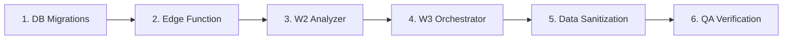

# 🏗️ Technical Blueprint: Contract Guardian Core Consolidation

**Versión**: 1.0.0 (Refactoring Phase)  
**Fecha**: 1 Febrero 2026  
**Tracks**: `CG-001`, `CG-002`, `CG-003`, `CG-004`, `CG-008`  
**Objetivo**: Establecer contratos de datos estrictos, integridad en la base de datos y fiabilidad operativa en los workflows.

---

## 1. DATA CONTRACTS (Source of Truth)

### 1.1 Taxonomía Canónica (CG-001)

*Single Source of Truth* para categorías. Cualquier sistema (Prompt, Router, Parser, DB) debe validar contra este `Set` exacto.

**Canonical List (`clause_category`):**

```typescript
const CANONICAL_FAMILIES = [
  "PaymentCredits",       // Facturación, pagos, créditos
  "ThirdPartyCredits",    // Créditos en pantalla
  "RepsProdCo",           // Garantías de la Productora
  "RepsAmazon",           // Garantías del Cliente (Amazon)
  "Indemnity",            // Indemnidad / Liability
  "TermTermination",      // Vigencia y Terminación
  "Confidentiality",      // NDA / Confidencialidad
  "GoverningLaw",         // Ley y Jurisdicción
  "ForceMajeure",         // Fuerza Mayor
  "Insurance",            // Seguros
  "IntellectualProperty", // IP / Copyright
  "AuditRights",          // Auditoría
  "DataPrivacy",          // GDPR / Datos
  "Publicity",            // Publicidad / Press Release
  "Assignment",           // Cesión
  "Subcontracting",       // Subcontratación
  "Notices",              // Notificaciones
  "Severability",         // Nulidad Parcial
  "Waiver",               // Renuncia
  "EntireAgreement",      // Acuerdo Completo
  "Survival",             // Supervivencia
  "Counterparts",         // Contrapartes
  "OtherUnknown"          // FALLBACK DEFAULT
] as const;
```

### 1.2 Semántica de Decisión (CG-002)

Mapeo estricto entre la "intención técnica" del Agente y el "estado de negocio" en DB.

| Agent Output (Internal) | DB Enum (`decision`) | UI State (`client_state`) | Badge |
|---|---|---|---|
| `AUTO_PASS` | `ACCEPT_AS_IS` | `OK` | 🟢 |
| `PASS_WITH_NOTES` | `APPROVE_WITH_NOTES` | `RECOMMENDED` | 🟡 |
| `BLOCK_EXPORT` | `REJECT` | `BLOCKED` | 🔴 |
| `CRITICAL_RISK` | `REJECT` | `BLOCKED` | 🔴 |
| `UNCERTAIN` | `ESCALATE_HUMAN` | `NEEDS_REVIEW` | 🟠 |
| *Error / Fallback* | `ESCALATE_HUMAN` | `NEEDS_REVIEW` | 🟠 |

---

## 2. DATABASE SPECIFICATION (Supabase)

### 2.1 Type Definitions (SQL)

Ejecutar migration para asegurar integridad referencial.

```sql
-- Migration: 20260201_core_types.sql

-- 1. Unificar Decision Enum
ALTER TYPE public.analysis_decision ADD VALUE IF NOT EXISTS 'ACCEPT_AS_IS';
ALTER TYPE public.analysis_decision ADD VALUE IF NOT EXISTS 'APPROVE_WITH_NOTES';
ALTER TYPE public.analysis_decision ADD VALUE IF NOT EXISTS 'REJECT';
ALTER TYPE public.analysis_decision ADD VALUE IF NOT EXISTS 'ESCALATE_HUMAN';

-- 2. Lifecycle Status Enum
ALTER TYPE public.run_status ADD VALUE IF NOT EXISTS 'COMPLETED_WITH_ERRORS';
ALTER TYPE public.run_status ADD VALUE IF NOT EXISTS 'FAILED';
ALTER TYPE public.run_status ADD VALUE IF NOT EXISTS 'TIMEOUT';

-- 3. Telemetría y Constraints (CG-001 + CG-005)
ALTER TABLE sanitizer_outputs
ADD COLUMN IF NOT EXISTS validation_passed BOOLEAN DEFAULT NULL,
ADD COLUMN IF NOT EXISTS processing_time_ms INTEGER DEFAULT 0,
ADD COLUMN IF NOT EXISTS router_method TEXT CHECK (router_method IN ('KEYWORD', 'LLM'));
```

### 2.2 Watchdog Automático (CG-003)

Implementación vía `pg_cron` para matar procesos zombies.

```sql
CREATE EXTENSION IF NOT EXISTS pg_cron;

SELECT cron.schedule(
    'zombie_killer',
    '*/30 * * * *', -- Ejecutar cada 30 min
    $$
    UPDATE contract_runs 
    SET status = 'TIMEOUT', error_log = 'Watchdog: Execution time limit exceeded'
    WHERE status = 'PROCESSING' 
    AND created_at < NOW() - INTERVAL '1 hour'
    $$
);
```

### 2.3 Data Sanitization (Limpieza Histórica)

Script obligatorio antes de desplegar el nuevo código para evitar errores de UI en contratos viejos.

```sql
-- Normalizar AUTO_PASS a ACCEPT_AS_IS
UPDATE sanitizer_outputs SET decision = 'ACCEPT_AS_IS' WHERE decision = 'AUTO_PASS';

-- Normalizar BLOCK_EXPORT a REJECT
UPDATE sanitizer_outputs SET decision = 'REJECT' WHERE decision IN ('BLOCK_EXPORT', 'CRITICAL_RISK');

-- Limpiar Client State para consistencia visual
UPDATE clause_reviews SET client_state = 'OK' 
WHERE id IN (SELECT clause_review_id FROM sanitizer_outputs WHERE decision = 'ACCEPT_AS_IS');
```

---

## 3. WORKFLOW SPECIFICATION (n8n)

### 3.1 Global Config Pattern (Best Practice)

Para evitar hardcoding disperso, implementaremos un nodo de configuración al inicio de W2 y W3.

- **Nodo**: "Global Config" (Code Node)
- **Output JSON**:
```json
{
  "valid_families": ["PaymentCredits", "Indemnity", "..."],
  "router_system_prompt": "You are a legal classifier...",
  "blueprint_version": "v4.2"
}
```

- **Uso**: Los nodos posteriores (LLM, Parser) referencian este nodo: `$node["Global Config"].json.valid_families`.

### 3.2 W3: Orchestrator Refactor (CG-003, CG-004)

1. **Context Injection (CG-004)**:
   - El payload a W2 debe incluir:
```json
{
  "clause_text": "...",
  "clause_heading": "12. INDEMNIFICATION",
  "contract_type": "psa_amazon",
  "run_id": "uuid"
}
```

2. **Lifecycle & Error Handling (CG-003)**:
   - Añadir nodo **Error Trigger** (Catch All).
   - Acción en fallo: HTTP Request a Supabase (`UPDATE contract_runs SET status='FAILED'...`).
   - **Completion Logic**: `if (errors > 0) status = 'COMPLETED_WITH_ERRORS'`

### 3.3 W2: Analyzer Refactor (CG-001, CG-002)

1. **Logic: Keyword Router**:
   - Actualizar lógica para usar `clause_heading` del input.
   - Si `heading` contiene "Indemn" (case insensitive) → forzar `Indemnity` (Bypass LLM).

2. **Logic: Sanitizer Node (Javascript)**:
```javascript
// Mapeo seguro
const DECISION_MAP = { 
  'AUTO_PASS': 'ACCEPT_AS_IS',
  'PASS_WITH_NOTES': 'APPROVE_WITH_NOTES',
  'BLOCK_EXPORT': 'REJECT',
  'CRITICAL_RISK': 'REJECT',
  'UNCERTAIN': 'ESCALATE_HUMAN'
};

const decision = DECISION_MAP[item.agent_decision] || 'ESCALATE_HUMAN';
const duration = new Date() - new Date(item.start_time);

return {
   decision: decision,
   processing_time_ms: duration,
   validation_passed: item.validation_result === 'PASSED'
}
```

---

## 4. SECURITY ARCHITECTURE (CG-008)

**Objetivo**: Eliminar credenciales `service_role` de n8n.

**Edge Function: `save_clause_review` (Supabase/Deno)**

```typescript
import { serve } from "https://deno.land/std@0.168.0/http/server.ts";
import { createClient } from "https://esm.sh/@supabase/supabase-js@2";

serve(async (req) => {
  const { secret, run_id, clause_data } = await req.json();
  
  if (secret !== Deno.env.get('N8N_PROXY_SECRET')) {
    return new Response('Unauthorized', { status: 401 });
  }

  const supabase = createClient(
    Deno.env.get('SUPABASE_URL')!,
    Deno.env.get('SUPABASE_SERVICE_ROLE_KEY')!
  );
  
  const { error } = await supabase
    .from('sanitizer_outputs')
    .insert({ run_id, ...clause_data });
    
  return new Response(JSON.stringify({ error }), { 
    status: error ? 500 : 200,
    headers: { 'Content-Type': 'application/json' }
  });
});
```

---

## 5. ROLLOUT PLAN



| Step | Component | Risk | Rollback |
|------|-----------|------|----------|
| 1 | SQL Enums + Telemetry | Low | DROP IF EXISTS |
| 2 | save_clause_review EF | Low | Delete function |
| 3 | W2 v4.2 | Medium | Revert to v4.1 |
| 4 | W3 v4 | Medium | Revert to v3 |
| 5 | Data Normalization | **High** | Backup required |
| 6 | QA Gates | None | N/A |

---

## 6. QA GATES (Definition of Done)

- [ ] **Taxonomy**: Texto de indemnización se clasifica como `Indemnity`, no `OtherUnknown`.
- [ ] **Semantics**: UI muestra Badge Verde (`OK`) para decisiones `AUTO_PASS`.
- [ ] **Lifecycle**: Si desconecto el Router Agent simulando error, el Run termina en `FAILED` o `COMPLETED_WITH_ERRORS`.
- [ ] **Security**: n8n no tiene variables de entorno con `SUPABASE_SERVICE_ROLE`.
