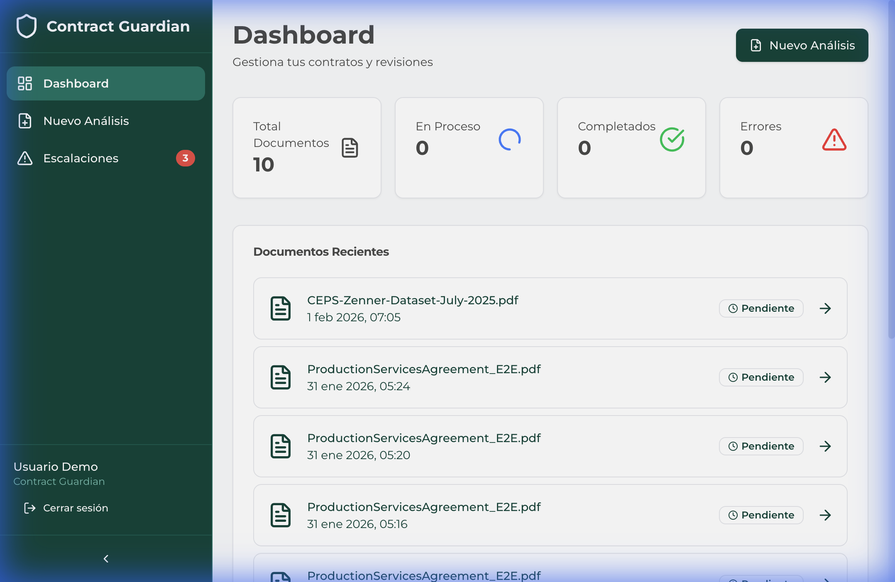
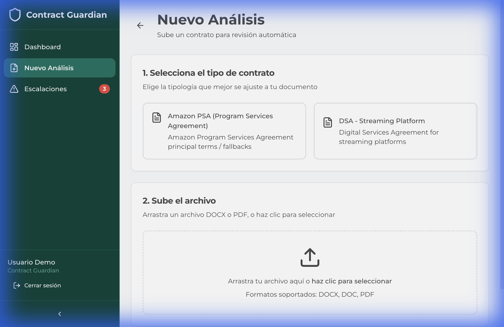
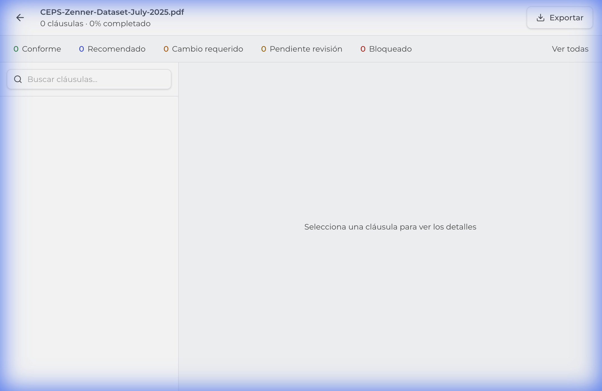
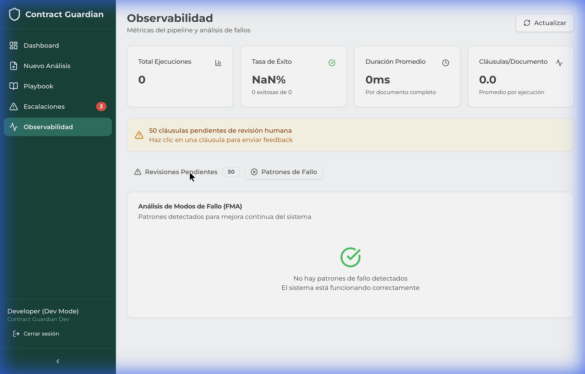
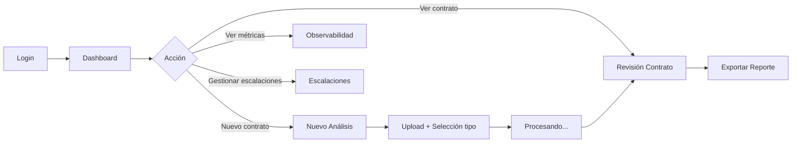

# Contract Guardian - UX Description

**Versión**: 4.1 | **Fecha**: Febrero 2026 | **Stack**: React + Vite + Shadcn/ui

---

## 1. Visión General

Contract Guardian es una plataforma de revisión automatizada de contratos que combina procesamiento de lenguaje natural con workflows agentic multi-modelo (RAG + LLM). La interfaz está diseñada para **abogados corporativos** y **equipos legales** que revisan acuerdos de servicios con Amazon (PSA/DSA).

### Principios de Diseño

| Principio | Implementación |
|-----------|----------------|
| **Claridad** | Jerarquía visual clara con tarjetas y espaciado generoso |
| **Eficiencia** | Navegación mínima, todo accesible en ≤2 clics |
| **Confianza** | Estados visibles, indicadores de progreso, feedback inmediato |
| **Profesionalismo** | Esquema de color corporativo verde-azul (#0D6E6E) |

---

## 2. Esquema de Color

```
Primary (Brand):     #0D6E6E (Verde azulado)
Primary Light:       #1A8A8A (Hover states)
Background:          #F0F4F8 (Gris azulado)
Surface:             #FFFFFF (Tarjetas)
Text Primary:        #1A202C
Text Secondary:      #718096
Success:             #38A169 (Verde)
Warning:             #D69E2E (Amarillo)
Error:               #E53E3E (Rojo)
Info:                #3182CE (Azul)
```

---

## 3. Pantallas Principales

### 3.1 Dashboard



**Propósito**: Centro de comando para monitorear el estado de todos los contratos.

**Componentes**:
- **Header**: Título "Dashboard" con botón CTA "Nuevo Análisis"
- **KPI Cards** (4):
  - Total Documentos (icono documento)
  - En Proceso (spinner animado)
  - Completados (checkmark verde)
  - Errores (triángulo warning)
- **Lista de Documentos Recientes**: Tabla con nombre, fecha, estado y flecha de acceso

**Estados de Documento**:
| Estado | Badge | Color |
|--------|-------|-------|
| Pendiente | `Pendiente` | Gris |
| Procesando | `En proceso` | Azul + spinner |
| Completado | `Completado` | Verde |
| Error | `Error` | Rojo |

---

### 3.2 Nuevo Análisis



**Propósito**: Wizard de 2 pasos para iniciar análisis de un nuevo contrato.

**Flujo**:
```
Paso 1: Selección de Tipo    →    Paso 2: Carga de Archivo
       ↓                                    ↓
   [Amazon PSA]                      [Drag & Drop Zone]
   [DSA Platform]                    DOCX, DOC, PDF
```

**Componentes**:
1. **Selector de Tipología** (2 cards exclusivas):
   - Amazon PSA (Program Services Agreement)
   - DSA - Streaming Platform (Digital Services Agreement)
2. **Zona de Upload**:
   - Drag & drop visual con icono cloud
   - Formatos soportados: DOCX, DOC, PDF
   - Indicador de progreso en carga

---

### 3.3 Revisión de Contrato



**Propósito**: Análisis detallado cláusula por cláusula con recomendaciones del sistema.

**Layout**: Dividido en 3 secciones:

```
┌─────────────────────────────────────────────────────────┐
│  Header: Nombre documento | Progreso | [Exportar]       │
├────────────────┬────────────────────────────────────────┤
│                │                                        │
│  Lista de      │  Panel de Detalle de Cláusula         │
│  Cláusulas     │  - Texto original                      │
│  (filtrable)   │  - Recomendación AI                   │
│                │  - Acciones                            │
│                │                                        │
└────────────────┴────────────────────────────────────────┘
```

**Filtros de Estado de Cláusula**:
| Estado | Color | Descripción |
|--------|-------|-------------|
| Conforme | Verde | Cláusula acceptable sin cambios |
| Recomendado | Azul | Sugerencia de mejora |
| Cambio Requerido | Naranja | Modificación necesaria |
| Pendiente Revisión | Gris | Requiere revisión humana |
| Bloqueado | Rojo | Cláusula crítica a renegociar |

**Acciones**:
- Buscar cláusulas por texto
- Exportar reporte completo
- Navegar entre cláusulas

---

### 3.4 Escalaciones

**Propósito**: Gestión de cláusulas que requieren intervención humana.

**Componentes**:
- **Badges de Estado**: Pendientes, En Revisión, Alta Urgencia, Resueltas
- **Filtros**: Búsqueda + dropdown de estado/prioridad
- **Layout Maestro-Detalle**: Lista izquierda, detalle derecha

**Flujo de Escalación**:
```
Cláusula Detectada → Confianza < Umbral → Escalar → Revisor Asigna → Resolver
```

---

### 3.5 Observabilidad



**Propósito**: Dashboard de métricas del pipeline de análisis.

**KPI Cards**:
| Métrica | Descripción |
|---------|-------------|
| Total Ejecuciones | Número de runs del pipeline |
| Tasa de Éxito | Porcentaje de runs exitosos |
| Duración Promedio | Tiempo medio por documento |
| Cláusulas/Documento | Promedio de cláusulas extraídas |

**Tabs de Análisis**:
1. **Revisiones Pendientes**: Lista de cláusulas esperando feedback humano
2. **Patrones de Fallo (FMA)**: Análisis de modos de fallo detectados

---

### 3.6 Playbook

**Propósito**: Configuración de reglas y políticas por familia de cláusula.

**Estructura**:
- Lista de familias de cláusula (22 familias en Router v4.1)
- Configuración de umbrales de confianza
- Políticas de escalación por tipo

---

## 4. Sidebar de Navegación

```
┌──────────────────────────┐
│   Contract Guardian      │ ← Logo
├──────────────────────────┤
│   Dashboard              │
│   Nuevo Análisis         │
│   Playbook               │
│   Escalaciones     (3)   │ ← Badge pendientes
│   Observabilidad         │
├──────────────────────────┤
│   ─────────────────      │
│   Developer (Dev Mode)   │ ← Solo en DEV
│   ─────────────────      │
│   Cerrar sesión          │
└──────────────────────────┘
```

---

## 5. Componentes UI Reutilizables

| Componente | Uso |
|------------|-----|
| `Card` | Contenedor para estadísticas y contenido agrupado |
| `Badge` | Estados y tags (variantes: default, success, warning, error) |
| `Button` | Acciones (primary verde, secondary outline, ghost) |
| `Tabs` | Navegación entre vistas relacionadas |
| `Table` | Listas de documentos, cláusulas, escalaciones |
| `Dialog` | Modales de feedback y confirmación |

---

## 6. Flujo de Usuario Principal



---

## 7. Estados de Carga y Feedback

| Estado | Indicador Visual |
|--------|------------------|
| Cargando | Spinner animado + skeleton |
| Éxito | Toast verde + checkmark |
| Error | Toast rojo + mensaje descriptivo |
| Vacío | Ilustración + CTA sugerido |

---

## 8. Responsive Design

- **Desktop** (≥1280px): Layout completo con sidebar visible
- **Tablet** (768-1279px): Sidebar colapsable
- **Mobile** (≤767px): Sidebar drawer, layout vertical

---

*Documento generado: 1 febrero 2026*
