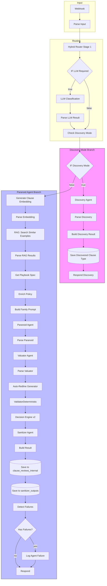

# W2 ClauseReview v2.5 - Discovery Mode Integration

**Version:** v2.5 (Discovery Mode)  
**Date:** 2026-02-02  
**Base:** W2_ClauseReview - Paranoid v2.4 (CG-012-FIX)

## Architecture Overview



## New Nodes Added (7 total)

| Node | Type | Purpose |
|------|------|---------|
| Check Discovery Mode | Code | Evaluates if clause should use Discovery Mode |
| IF Discovery Mode | IF | Branches based on `_use_discovery_mode` flag |
| Discovery Agent | OpenAI | Analyzes unknown clauses using general principles |
| Parse Discovery | Code | Parses Discovery Agent JSON response |
| Build Discovery Result | Code | Maps data to Supabase schema |
| Save Discovered Clause Type | Supabase | Persists to `discovered_clause_types` table |
| Respond Discovery | Webhook Response | Returns client-facing response |

## Discovery Mode Activation Criteria

Discovery Mode activates when ANY of these conditions are true:

1. **Unknown Family**: `detected_family === 'OtherUnknown'`
2. **Low Confidence**: `routing_confidence < 0.50`
3. **LLM Required + Very Low Confidence**: `needs_llm_fallback && routing_confidence < 0.40`
4. **No Playbook Spec**: Family not in KNOWN_FAMILIES list

## Known Families (37 total)

### CRITICAL Priority
- IndemnityProdCo, IndemnityAmazon, IndemnityProcedures
- RepsProdCo, RightsGrant, RightsReversion
- LiabilityLimitation, InjunctiveReliefWaiver
- TerminationRights, TerminationConsequences
- PaymentCredits, ThirdPartyCredits
- SurvivalRemedies, AmazonControl, Assignment
- MoralRights, AIPolicy

### HIGH Priority
- DisputeResolution, Confidentiality, Insurance, ForceMajeure
- CreativeControl, KeyPersons, DeliveryAcceptance, BudgetOverages

### MEDIUM Priority
- DataProtection, ServicesScope, AuditRights, TaxProvisions
- Publicity, PowerOfAttorney, ConditionsPrecedent, StandardTerms

## Supabase Table: discovered_clause_types

| Column | Type | Required | Description |
|--------|------|----------|-------------|
| id | UUID | Yes | Auto-generated |
| discovered_at | timestamptz | No | When discovered |
| source_clause_instance_id | UUID | No | Source clause |
| source_document_id | UUID | No | Source document |
| source_run_id | UUID | No | Source run |
| proposed_family_id | text | **Yes** | Suggested family ID |
| proposed_display_name | text | **Yes** | Human-readable name |
| proposed_priority | text | No | CRITICAL/HIGH/MEDIUM/LOW |
| clause_characterization | jsonb | No | Analysis of clause type |
| directional_analysis | jsonb | No | Who benefits/obligates |
| risk_identification | jsonb | No | Red flags found |
| suggested_red_flags | text[] | No | Patterns to watch for |
| suggested_must_have | text[] | No | Required elements |
| suggested_standard_position | text | No | Recommended position |
| reviewed_by | text | No | Reviewer |
| reviewed_at | timestamptz | No | Review timestamp |
| review_decision | text | No | CREATE_SPEC/MAP_TO_EXISTING/REJECT/PENDING |
| mapped_to_family_id | text | No | If mapped to existing |
| notes | text | No | Human review notes |
| occurrence_count | int | No | How many times seen |
| example_clauses | jsonb | No | Example clause texts |

## Deployment Steps

1. **Import Workflow**:
   ```bash
   # In n8n Cloud
   Import: W2_ClauseReview - Paranoid v2.5 (Discovery Mode).json
   ```

2. **Verify Credentials**:
   - OpenAI API: `amazon redliner` (id: SIqSVUfX83ooZaUa)
   - Supabase API: `contract-guardian` (id: 9SZmGHb4kHp3H92H)

3. **Activate Workflow**

4. **Test with Canary**:
   ```bash
   curl -X POST https://n8n.contractguardian.com/webhook/clause-review-rag \
     -H "Content-Type: application/json" \
     -d '{
       "clause_instance_id": "test-discovery-001",
       "clause_text": "ProdCo shall have a first negotiation right for any sequel, prequel, or spin-off derived from the Program."
     }'
   ```

## Expected Discovery Mode Response

```json
{
  "clause_instance_id": "test-discovery-001",
  "detected_family": "OtherUnknown",
  "decision": "ESCALATE_HUMAN",
  "client_state": "NEEDS_REVIEW",
  "client_comment": "This clause type requires legal team review. Suggested classification: SequelDerivativeRights. Risk level: HIGH.",
  "safety_pass": true,
  "discovery_mode": true
}
```

## Files

- **Workflow**: `n8n/wf operativos 0102_/W2_ClauseReview - Paranoid v2.5 (Discovery Mode).json`
- **Integration Script**: `n8n/wf operativos 0102_/integrate_discovery_mode.js`
- **Check Discovery Code**: `n8n/nodes/check_discovery_mode.js`
- **Discovery Agent Prompt**: `prompts/DISCOVERY_AGENT_PROMPT.md`
